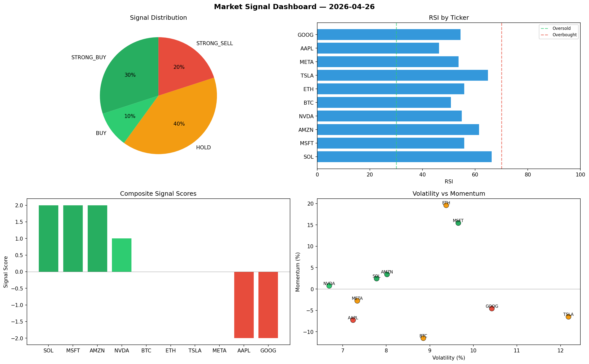

# Market Signal Report — 2026-04-26

**Run ID:** `224a5617fc` | **Buy:** 4 | **Sell:** 2 | **Hold:** 4

## Signal Dashboard

| Ticker | Price | Signal | Score | RSI | Momentum | Confidence |
|--------|-------|--------|-------|-----|----------|------------|
| SOL | $5029.35 | **STRONG_BUY** | 2 | 66.28 | 0.0244 | 0.5 |
| MSFT | $3049.34 | **STRONG_BUY** | 2 | 55.83 | 0.1544 | 0.5 |
| AMZN | $4226.49 | **STRONG_BUY** | 2 | 61.44 | 0.0342 | 0.5 |
| NVDA | $665.45 | **BUY** | 1 | 54.95 | 0.0075 | 0.25 |
| BTC | $1039.26 | **HOLD** | 0 | 50.79 | -0.115 | 0.0 |
| ETH | $4088.66 | **HOLD** | 0 | 55.81 | 0.196 | 0.0 |
| TSLA | $4824.05 | **HOLD** | 0 | 64.89 | -0.065 | 0.0 |
| META | $3926.8 | **HOLD** | 0 | 53.67 | -0.0276 | 0.0 |
| AAPL | $3144.97 | **STRONG_SELL** | -2 | 46.29 | -0.0728 | 0.5 |
| GOOG | $1238.69 | **STRONG_SELL** | -2 | 54.43 | -0.0457 | 0.5 |

## Delta vs Yesterday

| Ticker | Today | Yesterday | Price Change | Signal Changed |
|--------|-------|-----------|-------------|----------------|
| SOL | STRONG_BUY | STRONG_BUY | 📈 135.73% | — |
| MSFT | STRONG_BUY | SELL | 📈 49.93% | ⚠️ YES |
| AMZN | STRONG_BUY | STRONG_BUY | 📈 27.88% | — |
| NVDA | BUY | SELL | 📉 -54.91% | ⚠️ YES |
| BTC | HOLD | HOLD | 📈 6.23% | — |
| ETH | HOLD | SELL | 📈 77.1% | ⚠️ YES |
| TSLA | HOLD | HOLD | 📈 301.78% | — |
| META | HOLD | STRONG_SELL | 📈 145.2% | ⚠️ YES |
| AAPL | STRONG_SELL | SELL | 📈 3870.42% | ⚠️ YES |
| GOOG | STRONG_SELL | BUY | 📉 -25.91% | ⚠️ YES |