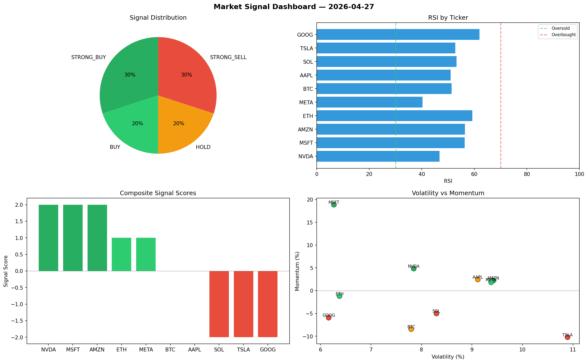

# Market Signal Report — 2026-04-27

**Run ID:** `3b7eddafed` | **Buy:** 5 | **Sell:** 3 | **Hold:** 2

## Signal Dashboard

| Ticker | Price | Signal | Score | RSI | Momentum | Confidence |
|--------|-------|--------|-------|-----|----------|------------|
| NVDA | $3499.13 | **STRONG_BUY** | 2 | 46.76 | 0.0485 | 0.5 |
| MSFT | $3758.95 | **STRONG_BUY** | 2 | 56.3 | 0.1887 | 0.5 |
| AMZN | $3990.55 | **STRONG_BUY** | 2 | 56.41 | 0.0223 | 0.5 |
| ETH | $1287.48 | **BUY** | 1 | 59.19 | -0.012 | 0.25 |
| META | $4184.12 | **BUY** | 1 | 40.3 | 0.0184 | 0.25 |
| BTC | $2251.49 | **HOLD** | 0 | 51.34 | -0.0845 | 0.0 |
| AAPL | $4668.4 | **HOLD** | 0 | 51.0 | 0.0245 | 0.0 |
| SOL | $3113.24 | **STRONG_SELL** | -2 | 53.22 | -0.0501 | 0.5 |
| TSLA | $1468.8 | **STRONG_SELL** | -2 | 52.71 | -0.1022 | 0.5 |
| GOOG | $2052.62 | **STRONG_SELL** | -2 | 61.91 | -0.0594 | 0.5 |

## Delta vs Yesterday

| Ticker | Today | Yesterday | Price Change | Signal Changed |
|--------|-------|-----------|-------------|----------------|
| NVDA | STRONG_BUY | HOLD | 📉 -31.92% | ⚠️ YES |
| MSFT | STRONG_BUY | BUY | 📉 -21.87% | ⚠️ YES |
| AMZN | STRONG_BUY | STRONG_SELL | 📈 654.29% | ⚠️ YES |
| ETH | BUY | STRONG_SELL | 📉 -41.12% | ⚠️ YES |
| META | BUY | STRONG_SELL | 📈 11.48% | ⚠️ YES |
| BTC | HOLD | SELL | 📈 7.96% | ⚠️ YES |
| AAPL | HOLD | STRONG_BUY | 📈 82.59% | ⚠️ YES |
| SOL | STRONG_SELL | HOLD | 📉 -36.69% | ⚠️ YES |
| TSLA | STRONG_SELL | STRONG_BUY | 📉 -61.89% | ⚠️ YES |
| GOOG | STRONG_SELL | STRONG_BUY | 📉 -43.77% | ⚠️ YES |