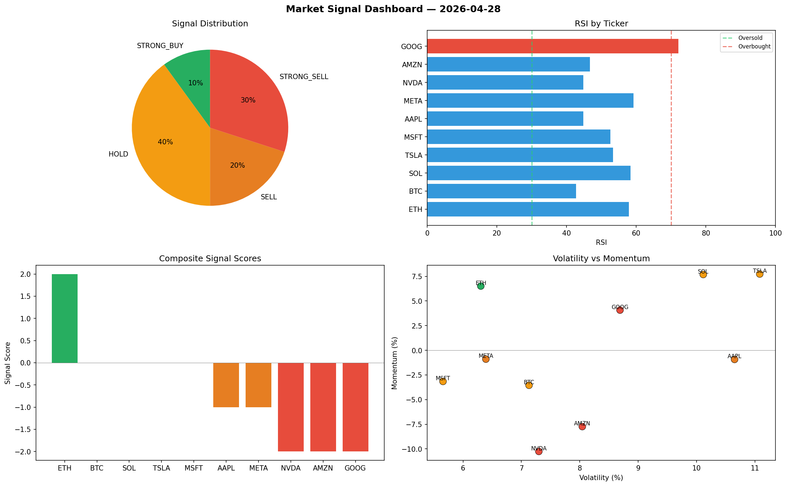

# Market Signal Report — 2026-04-28

**Run ID:** `f16c98e7f6` | **Buy:** 1 | **Sell:** 5 | **Hold:** 4

## Signal Dashboard

| Ticker | Price | Signal | Score | RSI | Momentum | Confidence |
|--------|-------|--------|-------|-----|----------|------------|
| ETH | $1268.87 | **STRONG_BUY** | 2 | 57.89 | 0.0651 | 0.5 |
| BTC | $638.3 | **HOLD** | 0 | 42.71 | -0.0355 | 0.0 |
| SOL | $3358.63 | **HOLD** | 0 | 58.35 | 0.0768 | 0.0 |
| TSLA | $1472.35 | **HOLD** | 0 | 53.3 | 0.0773 | 0.0 |
| MSFT | $3380.27 | **HOLD** | 0 | 52.56 | -0.0316 | 0.0 |
| AAPL | $1738.69 | **SELL** | -1 | 44.78 | -0.0093 | 0.25 |
| META | $4528.7 | **SELL** | -1 | 59.25 | -0.009 | 0.25 |
| NVDA | $4566.61 | **STRONG_SELL** | -2 | 44.83 | -0.1026 | 0.5 |
| AMZN | $2821.43 | **STRONG_SELL** | -2 | 46.71 | -0.0774 | 0.5 |
| GOOG | $1119.17 | **STRONG_SELL** | -2 | 72.14 | 0.0407 | 0.5 |

## Delta vs Yesterday

| Ticker | Today | Yesterday | Price Change | Signal Changed |
|--------|-------|-----------|-------------|----------------|
| ETH | STRONG_BUY | BUY | 📉 -1.45% | ⚠️ YES |
| BTC | HOLD | HOLD | 📉 -71.65% | — |
| SOL | HOLD | STRONG_SELL | 📈 7.88% | ⚠️ YES |
| TSLA | HOLD | STRONG_SELL | 📈 0.24% | ⚠️ YES |
| MSFT | HOLD | STRONG_BUY | 📉 -10.07% | ⚠️ YES |
| AAPL | SELL | HOLD | 📉 -62.76% | ⚠️ YES |
| META | SELL | BUY | 📈 8.24% | ⚠️ YES |
| NVDA | STRONG_SELL | STRONG_BUY | 📈 30.51% | ⚠️ YES |
| AMZN | STRONG_SELL | STRONG_BUY | 📉 -29.3% | ⚠️ YES |
| GOOG | STRONG_SELL | STRONG_SELL | 📉 -45.48% | — |