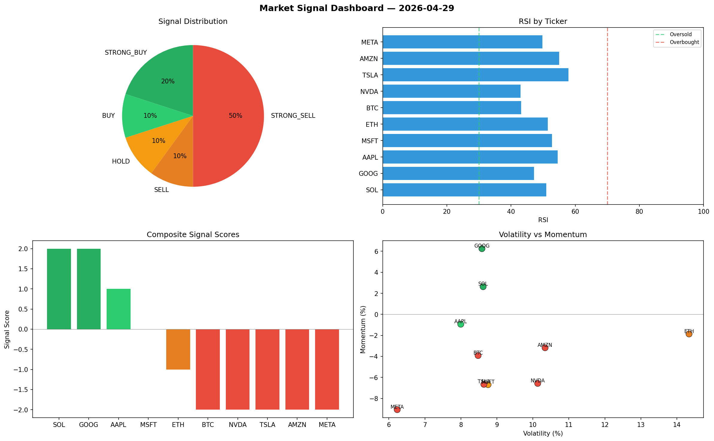

# Market Signal Report — 2026-04-29

**Run ID:** `60e1d190e2` | **Buy:** 3 | **Sell:** 6 | **Hold:** 1

## Signal Dashboard

| Ticker | Price | Signal | Score | RSI | Momentum | Confidence |
|--------|-------|--------|-------|-----|----------|------------|
| SOL | $1458.7 | **STRONG_BUY** | 2 | 50.95 | 0.0263 | 0.5 |
| GOOG | $1617.76 | **STRONG_BUY** | 2 | 47.2 | 0.0625 | 0.5 |
| AAPL | $2807.04 | **BUY** | 1 | 54.52 | -0.0094 | 0.25 |
| MSFT | $2927.33 | **HOLD** | 0 | 52.78 | -0.0669 | 0.0 |
| ETH | $551.69 | **SELL** | -1 | 51.44 | -0.0187 | 0.25 |
| BTC | $2696.26 | **STRONG_SELL** | -2 | 43.19 | -0.0392 | 0.5 |
| NVDA | $2087.98 | **STRONG_SELL** | -2 | 42.98 | -0.0657 | 0.5 |
| TSLA | $4122.73 | **STRONG_SELL** | -2 | 57.91 | -0.0666 | 0.5 |
| AMZN | $1031.28 | **STRONG_SELL** | -2 | 54.96 | -0.0318 | 0.5 |
| META | $2784.48 | **STRONG_SELL** | -2 | 49.76 | -0.0907 | 0.5 |

## Delta vs Yesterday

| Ticker | Today | Yesterday | Price Change | Signal Changed |
|--------|-------|-----------|-------------|----------------|
| SOL | STRONG_BUY | SELL | 📉 -29.07% | ⚠️ YES |
| GOOG | STRONG_BUY | STRONG_BUY | 📉 -26.13% | — |
| AAPL | BUY | STRONG_BUY | 📈 77.68% | ⚠️ YES |
| MSFT | HOLD | HOLD | 📉 -30.73% | — |
| ETH | SELL | HOLD | 📉 -88.52% | ⚠️ YES |
| BTC | STRONG_SELL | STRONG_BUY | 📈 21.46% | ⚠️ YES |
| NVDA | STRONG_SELL | HOLD | 📉 -39.09% | ⚠️ YES |
| TSLA | STRONG_SELL | SELL | 📈 104.73% | ⚠️ YES |
| AMZN | STRONG_SELL | STRONG_SELL | 📉 -58.25% | — |
| META | STRONG_SELL | STRONG_SELL | 📈 900.39% | — |