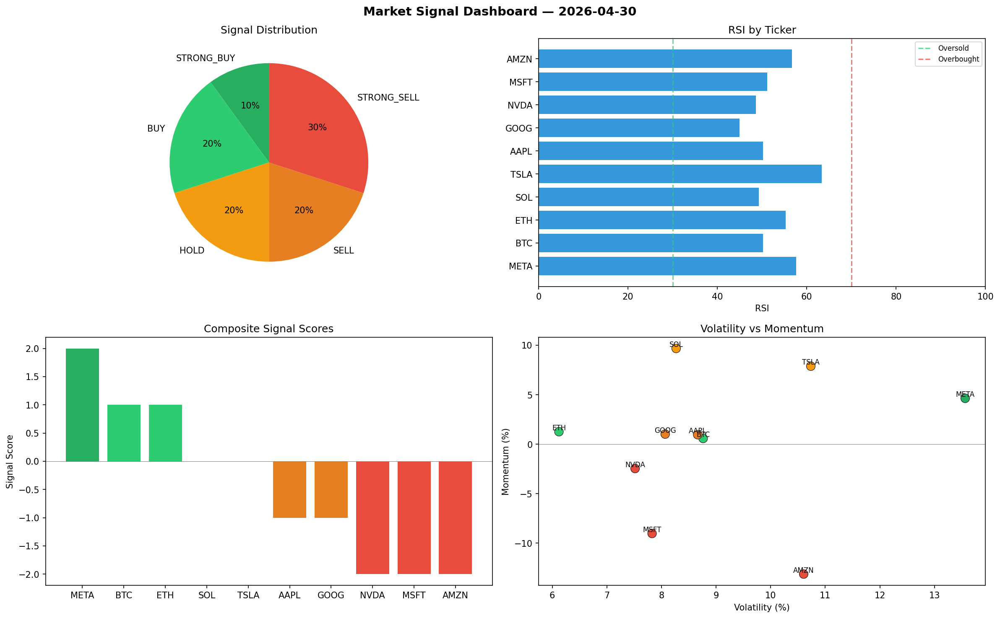

# Market Signal Report — 2026-04-30

**Run ID:** `a048688de7` | **Buy:** 3 | **Sell:** 5 | **Hold:** 2

## Signal Dashboard

| Ticker | Price | Signal | Score | RSI | Momentum | Confidence |
|--------|-------|--------|-------|-----|----------|------------|
| META | $4756.15 | **STRONG_BUY** | 2 | 57.65 | 0.0463 | 0.5 |
| BTC | $3093.52 | **BUY** | 1 | 50.17 | 0.0058 | 0.25 |
| ETH | $3630.75 | **BUY** | 1 | 55.29 | 0.0126 | 0.25 |
| SOL | $3279.24 | **HOLD** | 0 | 49.25 | 0.0967 | 0.0 |
| TSLA | $2548.3 | **HOLD** | 0 | 63.33 | 0.0788 | 0.0 |
| AAPL | $1789.72 | **SELL** | -1 | 50.25 | 0.0096 | 0.25 |
| GOOG | $4976.25 | **SELL** | -1 | 45.0 | 0.0102 | 0.25 |
| NVDA | $343.87 | **STRONG_SELL** | -2 | 48.66 | -0.0246 | 0.5 |
| MSFT | $1642.35 | **STRONG_SELL** | -2 | 51.17 | -0.0902 | 0.5 |
| AMZN | $2576.13 | **STRONG_SELL** | -2 | 56.71 | -0.1312 | 0.5 |

## Delta vs Yesterday

| Ticker | Today | Yesterday | Price Change | Signal Changed |
|--------|-------|-----------|-------------|----------------|
| META | STRONG_BUY | STRONG_BUY | 📈 36.67% | — |
| BTC | BUY | STRONG_BUY | 📉 -19.85% | ⚠️ YES |
| ETH | BUY | STRONG_SELL | 📈 351.99% | ⚠️ YES |
| SOL | HOLD | SELL | 📉 -31.48% | ⚠️ YES |
| TSLA | HOLD | STRONG_BUY | 📈 114.2% | ⚠️ YES |
| AAPL | SELL | HOLD | 📈 331.51% | ⚠️ YES |
| GOOG | SELL | HOLD | 📈 8.75% | ⚠️ YES |
| NVDA | STRONG_SELL | STRONG_BUY | 📉 -91.53% | ⚠️ YES |
| MSFT | STRONG_SELL | STRONG_SELL | 📉 -64.52% | — |
| AMZN | STRONG_SELL | STRONG_SELL | 📈 37.9% | — |