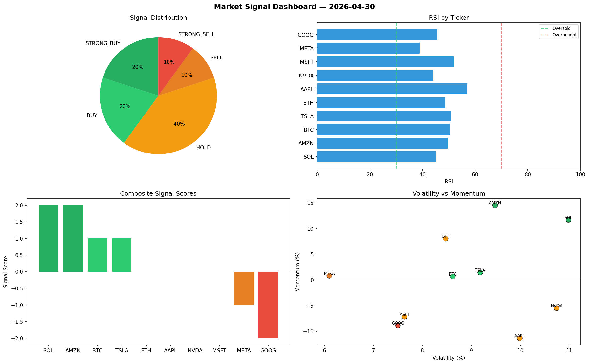

# Market Signal Report — 2026-04-30

**Run ID:** `f8b6b47e69` | **Buy:** 3 | **Sell:** 5 | **Hold:** 2

## Signal Dashboard

| Ticker | Price | Signal | Score | RSI | Momentum | Confidence |
|--------|-------|--------|-------|-----|----------|------------|
| ETH | $1838.17 | **STRONG_BUY** | 2 | 63.4 | 0.0577 | 0.5 |
| META | $332.75 | **STRONG_BUY** | 2 | 62.56 | 0.0363 | 0.5 |
| MSFT | $4643.08 | **BUY** | 1 | 49.32 | -0.0169 | 0.25 |
| BTC | $3378.47 | **HOLD** | 0 | 47.27 | -0.1372 | 0.0 |
| SOL | $1512.87 | **HOLD** | 0 | 61.88 | -0.1138 | 0.0 |
| NVDA | $4924.91 | **SELL** | -1 | 49.22 | 0.0 | 0.25 |
| GOOG | $3077.74 | **SELL** | -1 | 61.62 | 0.018 | 0.25 |
| AAPL | $1342.27 | **STRONG_SELL** | -2 | 58.84 | -0.0494 | 0.5 |
| TSLA | $3407.93 | **STRONG_SELL** | -2 | 47.41 | -0.052 | 0.5 |
| AMZN | $3327.31 | **STRONG_SELL** | -2 | 38.74 | -0.1728 | 0.5 |

## Delta vs Yesterday

| Ticker | Today | Yesterday | Price Change | Signal Changed |
|--------|-------|-----------|-------------|----------------|
| ETH | STRONG_BUY | STRONG_SELL | 📈 128.83% | ⚠️ YES |
| META | STRONG_BUY | STRONG_BUY | 📉 -90.44% | — |
| MSFT | BUY | STRONG_SELL | 📈 0.32% | ⚠️ YES |
| BTC | HOLD | STRONG_BUY | 📉 -12.46% | ⚠️ YES |
| SOL | HOLD | SELL | 📉 -68.39% | ⚠️ YES |
| NVDA | SELL | STRONG_BUY | 📈 21.24% | ⚠️ YES |
| GOOG | SELL | HOLD | 📉 -32.74% | ⚠️ YES |
| AAPL | STRONG_SELL | HOLD | 📈 223.63% | ⚠️ YES |
| TSLA | STRONG_SELL | STRONG_BUY | 📈 186.45% | ⚠️ YES |
| AMZN | STRONG_SELL | STRONG_SELL | 📈 78.11% | — |