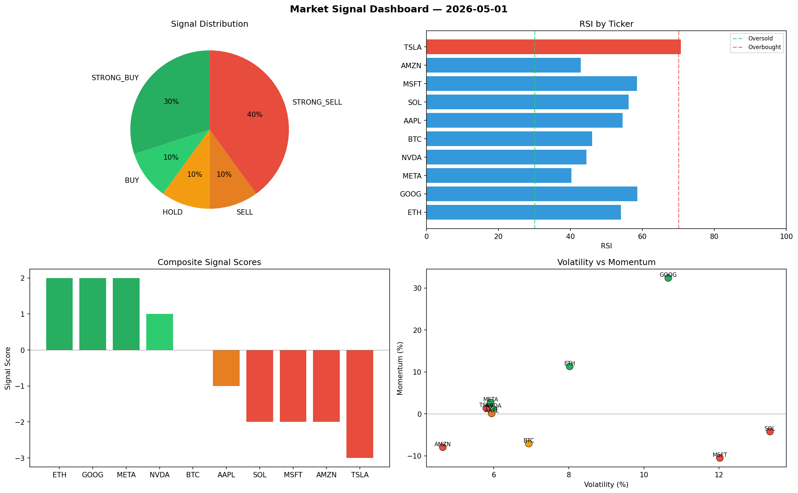

# Market Signal Report — 2026-05-01

**Run ID:** `cd432dc375` | **Buy:** 4 | **Sell:** 5 | **Hold:** 1

## Signal Dashboard

| Ticker | Price | Signal | Score | RSI | Momentum | Confidence |
|--------|-------|--------|-------|-----|----------|------------|
| ETH | $4372.78 | **STRONG_BUY** | 2 | 54.02 | 0.113 | 0.5 |
| GOOG | $1185.5 | **STRONG_BUY** | 2 | 58.61 | 0.3238 | 0.5 |
| META | $1690.36 | **STRONG_BUY** | 2 | 40.25 | 0.0271 | 0.5 |
| NVDA | $1271.21 | **BUY** | 1 | 44.47 | 0.0112 | 0.25 |
| BTC | $181.31 | **HOLD** | 0 | 46.04 | -0.0711 | 0.0 |
| AAPL | $4763.08 | **SELL** | -1 | 54.54 | 0.0007 | 0.25 |
| SOL | $4404.95 | **STRONG_SELL** | -2 | 56.2 | -0.0424 | 0.5 |
| MSFT | $959.7 | **STRONG_SELL** | -2 | 58.48 | -0.1053 | 0.5 |
| AMZN | $1702.92 | **STRONG_SELL** | -2 | 42.87 | -0.0798 | 0.5 |
| TSLA | $1322.68 | **STRONG_SELL** | -3 | 70.66 | 0.0135 | 0.75 |

## Delta vs Yesterday

| Ticker | Today | Yesterday | Price Change | Signal Changed |
|--------|-------|-----------|-------------|----------------|
| ETH | STRONG_BUY | STRONG_BUY | 📈 137.89% | — |
| GOOG | STRONG_BUY | SELL | 📉 -61.48% | ⚠️ YES |
| META | STRONG_BUY | STRONG_BUY | 📈 408.0% | — |
| NVDA | BUY | SELL | 📉 -74.19% | ⚠️ YES |
| BTC | HOLD | HOLD | 📉 -94.63% | — |
| AAPL | SELL | STRONG_SELL | 📈 254.85% | ⚠️ YES |
| SOL | STRONG_SELL | HOLD | 📈 191.17% | ⚠️ YES |
| MSFT | STRONG_SELL | BUY | 📉 -79.33% | ⚠️ YES |
| AMZN | STRONG_SELL | STRONG_SELL | 📉 -48.82% | — |
| TSLA | STRONG_SELL | STRONG_SELL | 📉 -61.19% | — |