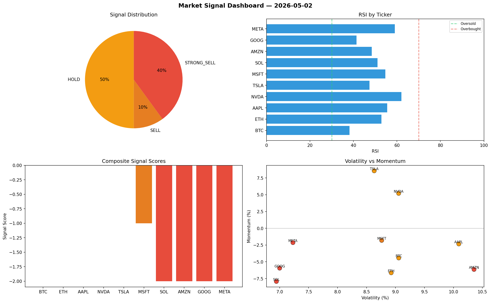

# Market Signal Report — 2026-05-02

**Run ID:** `3dbac122a8` | **Buy:** 0 | **Sell:** 5 | **Hold:** 5

## Signal Dashboard

| Ticker | Price | Signal | Score | RSI | Momentum | Confidence |
|--------|-------|--------|-------|-----|----------|------------|
| BTC | $2756.97 | **HOLD** | 0 | 38.16 | -0.0443 | 0.0 |
| ETH | $4478.45 | **HOLD** | 0 | 52.85 | -0.0664 | 0.0 |
| AAPL | $4682.08 | **HOLD** | 0 | 55.47 | -0.0234 | 0.0 |
| NVDA | $1282.29 | **HOLD** | 0 | 62.06 | 0.052 | 0.0 |
| TSLA | $4900.67 | **HOLD** | 0 | 47.34 | 0.0856 | 0.0 |
| MSFT | $4559.38 | **SELL** | -1 | 54.68 | -0.0181 | 0.25 |
| SOL | $1365.5 | **STRONG_SELL** | -2 | 51.07 | -0.0793 | 0.5 |
| AMZN | $1657.8 | **STRONG_SELL** | -2 | 48.44 | -0.0614 | 0.5 |
| GOOG | $1697.52 | **STRONG_SELL** | -2 | 41.43 | -0.0595 | 0.5 |
| META | $1152.72 | **STRONG_SELL** | -2 | 59.02 | -0.0214 | 0.5 |

## Delta vs Yesterday

| Ticker | Today | Yesterday | Price Change | Signal Changed |
|--------|-------|-----------|-------------|----------------|
| BTC | HOLD | BUY | 📈 284.12% | ⚠️ YES |
| ETH | HOLD | HOLD | 📈 42.39% | — |
| AAPL | HOLD | SELL | 📈 275.67% | ⚠️ YES |
| NVDA | HOLD | BUY | 📉 -51.6% | ⚠️ YES |
| TSLA | HOLD | STRONG_BUY | 📉 -5.74% | ⚠️ YES |
| MSFT | SELL | HOLD | 📈 224.72% | ⚠️ YES |
| SOL | STRONG_SELL | STRONG_SELL | 📉 -71.5% | — |
| AMZN | STRONG_SELL | STRONG_BUY | 📈 268.49% | ⚠️ YES |
| GOOG | STRONG_SELL | STRONG_BUY | 📉 -58.44% | ⚠️ YES |
| META | STRONG_SELL | STRONG_SELL | 📉 -2.97% | — |