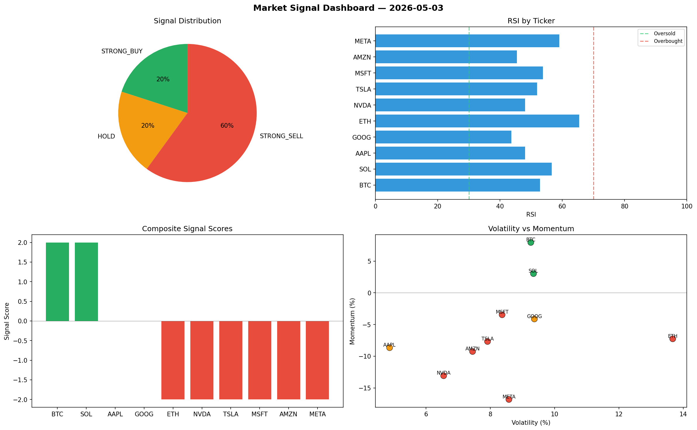

# Market Signal Report — 2026-05-03

**Run ID:** `6ce2857e08` | **Buy:** 2 | **Sell:** 6 | **Hold:** 2

## Signal Dashboard

| Ticker | Price | Signal | Score | RSI | Momentum | Confidence |
|--------|-------|--------|-------|-----|----------|------------|
| BTC | $1848.27 | **STRONG_BUY** | 2 | 52.88 | 0.0794 | 0.5 |
| SOL | $1667.82 | **STRONG_BUY** | 2 | 56.56 | 0.0303 | 0.5 |
| AAPL | $1885.49 | **HOLD** | 0 | 48.08 | -0.0865 | 0.0 |
| GOOG | $1754.86 | **HOLD** | 0 | 43.62 | -0.0412 | 0.0 |
| ETH | $4426.28 | **STRONG_SELL** | -2 | 65.38 | -0.0725 | 0.5 |
| NVDA | $2291.29 | **STRONG_SELL** | -2 | 48.02 | -0.1307 | 0.5 |
| TSLA | $1168.49 | **STRONG_SELL** | -2 | 51.86 | -0.0767 | 0.5 |
| MSFT | $512.06 | **STRONG_SELL** | -2 | 53.81 | -0.0346 | 0.5 |
| AMZN | $455.72 | **STRONG_SELL** | -2 | 45.42 | -0.0925 | 0.5 |
| META | $1735.05 | **STRONG_SELL** | -2 | 59.04 | -0.1681 | 0.5 |

## Delta vs Yesterday

| Ticker | Today | Yesterday | Price Change | Signal Changed |
|--------|-------|-----------|-------------|----------------|
| BTC | STRONG_BUY | HOLD | 📈 50.97% | ⚠️ YES |
| SOL | STRONG_BUY | STRONG_SELL | 📉 -7.39% | ⚠️ YES |
| AAPL | HOLD | STRONG_SELL | 📈 75.72% | ⚠️ YES |
| GOOG | HOLD | STRONG_BUY | 📉 -62.8% | ⚠️ YES |
| ETH | STRONG_SELL | STRONG_BUY | 📈 0.99% | ⚠️ YES |
| NVDA | STRONG_SELL | BUY | 📉 -46.8% | ⚠️ YES |
| TSLA | STRONG_SELL | STRONG_BUY | 📉 -58.92% | ⚠️ YES |
| MSFT | STRONG_SELL | SELL | 📉 -86.01% | ⚠️ YES |
| AMZN | STRONG_SELL | STRONG_BUY | 📉 -90.24% | ⚠️ YES |
| META | STRONG_SELL | STRONG_BUY | 📈 88.93% | ⚠️ YES |