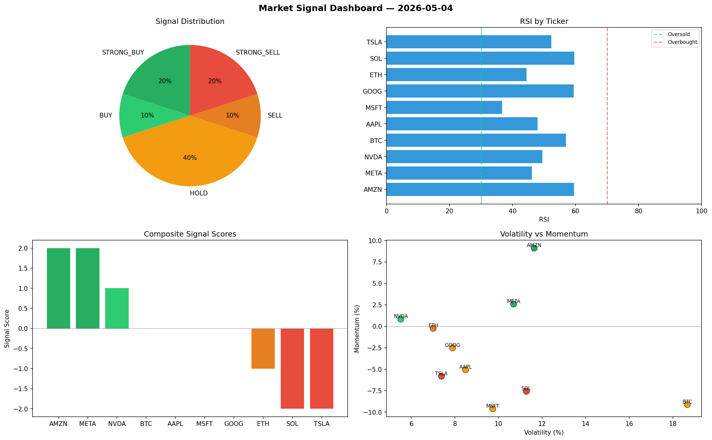

# Market Signal Report — 2026-05-04

**Run ID:** `152e7aa415` | **Buy:** 3 | **Sell:** 3 | **Hold:** 4

## Signal Dashboard

| Ticker | Price | Signal | Score | RSI | Momentum | Confidence |
|--------|-------|--------|-------|-----|----------|------------|
| AMZN | $1506.89 | **STRONG_BUY** | 2 | 59.52 | 0.0911 | 0.5 |
| META | $4747.48 | **STRONG_BUY** | 2 | 46.14 | 0.0259 | 0.5 |
| NVDA | $4852.7 | **BUY** | 1 | 49.47 | 0.0083 | 0.25 |
| BTC | $2548.11 | **HOLD** | 0 | 56.93 | -0.0913 | 0.0 |
| AAPL | $946.5 | **HOLD** | 0 | 47.97 | -0.0507 | 0.0 |
| MSFT | $2737.6 | **HOLD** | 0 | 36.65 | -0.0961 | 0.0 |
| GOOG | $1547.36 | **HOLD** | 0 | 59.39 | -0.0252 | 0.0 |
| ETH | $1578.4 | **SELL** | -1 | 44.46 | -0.0024 | 0.25 |
| SOL | $54.01 | **STRONG_SELL** | -2 | 59.58 | -0.0758 | 0.5 |
| TSLA | $2377.12 | **STRONG_SELL** | -2 | 52.3 | -0.0582 | 0.5 |

## Delta vs Yesterday

| Ticker | Today | Yesterday | Price Change | Signal Changed |
|--------|-------|-----------|-------------|----------------|
| AMZN | STRONG_BUY | STRONG_SELL | 📈 230.66% | ⚠️ YES |
| META | STRONG_BUY | STRONG_SELL | 📈 173.62% | ⚠️ YES |
| NVDA | BUY | STRONG_SELL | 📈 111.79% | ⚠️ YES |
| BTC | HOLD | STRONG_BUY | 📈 37.86% | ⚠️ YES |
| AAPL | HOLD | HOLD | 📉 -49.8% | — |
| MSFT | HOLD | STRONG_SELL | 📈 434.62% | ⚠️ YES |
| GOOG | HOLD | HOLD | 📉 -11.82% | — |
| ETH | SELL | STRONG_SELL | 📉 -64.34% | ⚠️ YES |
| SOL | STRONG_SELL | STRONG_BUY | 📉 -96.76% | ⚠️ YES |
| TSLA | STRONG_SELL | STRONG_SELL | 📈 103.44% | — |