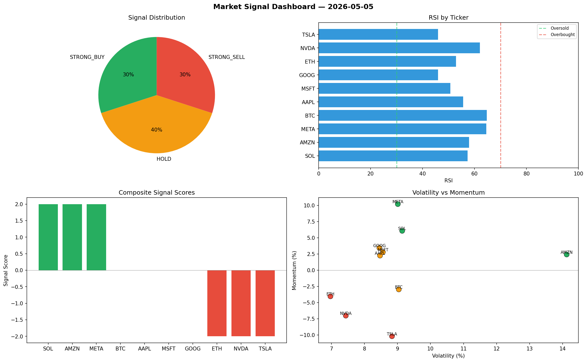

# Market Signal Report — 2026-05-05

**Run ID:** `5cc1a36c1b` | **Buy:** 3 | **Sell:** 3 | **Hold:** 4

## Signal Dashboard

| Ticker | Price | Signal | Score | RSI | Momentum | Confidence |
|--------|-------|--------|-------|-----|----------|------------|
| SOL | $4455.96 | **STRONG_BUY** | 2 | 57.28 | 0.0606 | 0.5 |
| AMZN | $229.47 | **STRONG_BUY** | 2 | 57.86 | 0.0241 | 0.5 |
| META | $5340.29 | **STRONG_BUY** | 2 | 64.56 | 0.1019 | 0.5 |
| BTC | $4887.07 | **HOLD** | 0 | 64.68 | -0.0298 | 0.0 |
| AAPL | $3223.92 | **HOLD** | 0 | 55.64 | 0.0224 | 0.0 |
| MSFT | $2513.89 | **HOLD** | 0 | 50.68 | 0.0279 | 0.0 |
| GOOG | $115.92 | **HOLD** | 0 | 45.98 | 0.0343 | 0.0 |
| ETH | $4145.26 | **STRONG_SELL** | -2 | 52.89 | -0.0405 | 0.5 |
| NVDA | $63.37 | **STRONG_SELL** | -2 | 62.1 | -0.0703 | 0.5 |
| TSLA | $4582.92 | **STRONG_SELL** | -2 | 45.94 | -0.1021 | 0.5 |

## Delta vs Yesterday

| Ticker | Today | Yesterday | Price Change | Signal Changed |
|--------|-------|-----------|-------------|----------------|
| SOL | STRONG_BUY | HOLD | 📈 928.24% | ⚠️ YES |
| AMZN | STRONG_BUY | STRONG_BUY | 📉 -94.97% | — |
| META | STRONG_BUY | STRONG_BUY | 📈 275.6% | — |
| BTC | HOLD | STRONG_SELL | 📈 1186.44% | ⚠️ YES |
| AAPL | HOLD | HOLD | 📈 7.23% | — |
| MSFT | HOLD | SELL | 📉 -7.53% | ⚠️ YES |
| GOOG | HOLD | HOLD | 📉 -86.95% | — |
| ETH | STRONG_SELL | SELL | 📈 3.84% | ⚠️ YES |
| NVDA | STRONG_SELL | STRONG_BUY | 📉 -98.28% | ⚠️ YES |
| TSLA | STRONG_SELL | BUY | 📈 17.78% | ⚠️ YES |