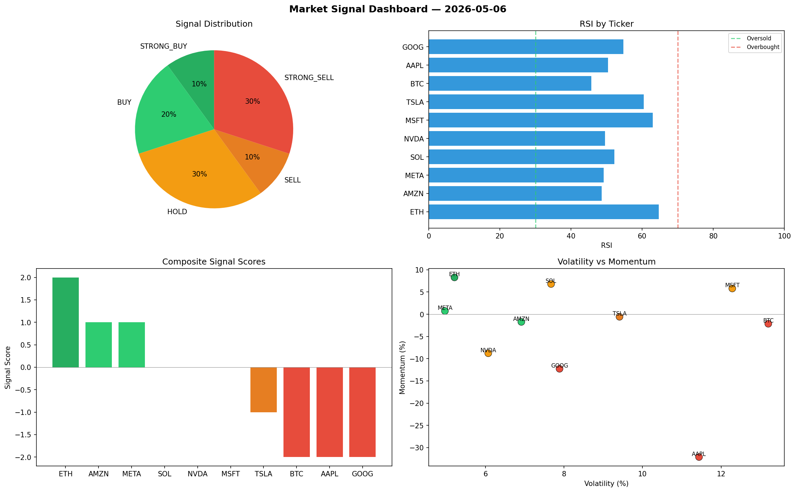

# Market Signal Report — 2026-05-06

**Run ID:** `5e7147bd42` | **Buy:** 3 | **Sell:** 4 | **Hold:** 3

## Signal Dashboard

| Ticker | Price | Signal | Score | RSI | Momentum | Confidence |
|--------|-------|--------|-------|-----|----------|------------|
| ETH | $2928.44 | **STRONG_BUY** | 2 | 64.71 | 0.0828 | 0.5 |
| AMZN | $4574.43 | **BUY** | 1 | 48.62 | -0.0173 | 0.25 |
| META | $1223.02 | **BUY** | 1 | 49.21 | 0.0072 | 0.25 |
| SOL | $4829.8 | **HOLD** | 0 | 52.14 | 0.068 | 0.0 |
| NVDA | $1469.12 | **HOLD** | 0 | 49.58 | -0.0878 | 0.0 |
| MSFT | $3960.76 | **HOLD** | 0 | 63.0 | 0.0579 | 0.0 |
| TSLA | $4202.79 | **SELL** | -1 | 60.4 | -0.0058 | 0.25 |
| BTC | $2534.21 | **STRONG_SELL** | -2 | 45.68 | -0.0215 | 0.5 |
| AAPL | $326.67 | **STRONG_SELL** | -2 | 50.37 | -0.3213 | 0.5 |
| GOOG | $2687.05 | **STRONG_SELL** | -2 | 54.69 | -0.1228 | 0.5 |

## Delta vs Yesterday

| Ticker | Today | Yesterday | Price Change | Signal Changed |
|--------|-------|-----------|-------------|----------------|
| ETH | STRONG_BUY | HOLD | 📈 3.85% | ⚠️ YES |
| AMZN | BUY | STRONG_BUY | 📈 28.83% | ⚠️ YES |
| META | BUY | BUY | 📉 -31.42% | — |
| SOL | HOLD | STRONG_SELL | 📈 382.06% | ⚠️ YES |
| NVDA | HOLD | BUY | 📈 38.28% | ⚠️ YES |
| MSFT | HOLD | STRONG_SELL | 📈 115.49% | ⚠️ YES |
| TSLA | SELL | STRONG_SELL | 📈 80.77% | ⚠️ YES |
| BTC | STRONG_SELL | SELL | 📈 13.81% | ⚠️ YES |
| AAPL | STRONG_SELL | STRONG_SELL | 📉 -92.76% | — |
| GOOG | STRONG_SELL | HOLD | 📉 -27.65% | ⚠️ YES |