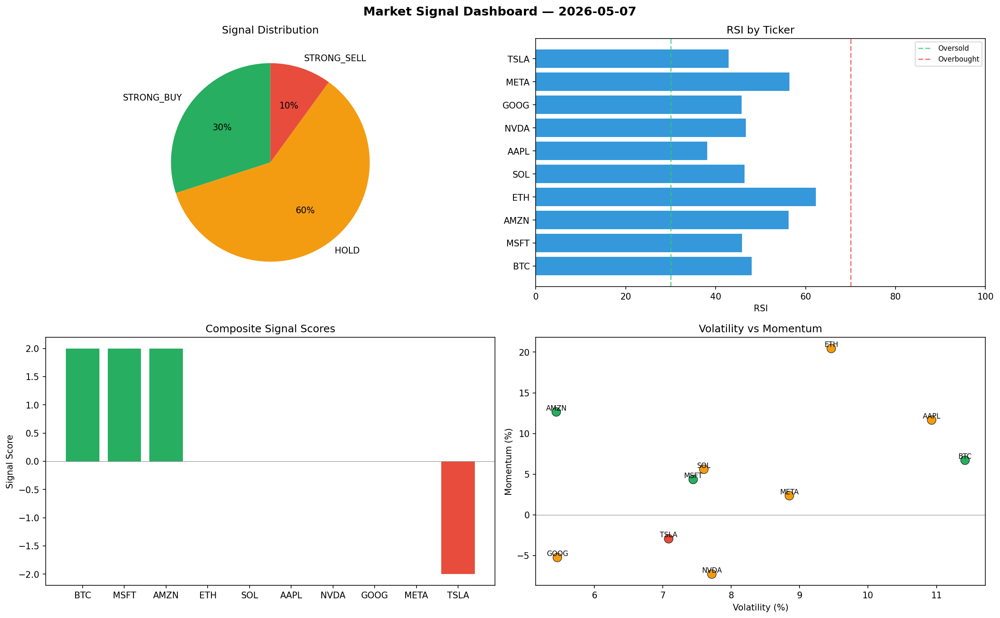

# Market Signal Report — 2026-05-07

**Run ID:** `2fd0b856aa` | **Buy:** 3 | **Sell:** 1 | **Hold:** 6

## Signal Dashboard

| Ticker | Price | Signal | Score | RSI | Momentum | Confidence |
|--------|-------|--------|-------|-----|----------|------------|
| BTC | $1274.13 | **STRONG_BUY** | 2 | 48.02 | 0.0671 | 0.5 |
| MSFT | $3712.34 | **STRONG_BUY** | 2 | 45.89 | 0.0435 | 0.5 |
| AMZN | $133.62 | **STRONG_BUY** | 2 | 56.23 | 0.1265 | 0.5 |
| ETH | $5617.78 | **HOLD** | 0 | 62.25 | 0.2045 | 0.0 |
| SOL | $4443.14 | **HOLD** | 0 | 46.44 | 0.056 | 0.0 |
| AAPL | $2859.37 | **HOLD** | 0 | 38.13 | 0.1165 | 0.0 |
| NVDA | $1062.55 | **HOLD** | 0 | 46.67 | -0.0728 | 0.0 |
| GOOG | $1373.21 | **HOLD** | 0 | 45.8 | -0.0524 | 0.0 |
| META | $1774.59 | **HOLD** | 0 | 56.38 | 0.0235 | 0.0 |
| TSLA | $3221.52 | **STRONG_SELL** | -2 | 42.9 | -0.0294 | 0.5 |

## Delta vs Yesterday

| Ticker | Today | Yesterday | Price Change | Signal Changed |
|--------|-------|-----------|-------------|----------------|
| BTC | STRONG_BUY | STRONG_SELL | 📉 -60.63% | ⚠️ YES |
| MSFT | STRONG_BUY | STRONG_SELL | 📈 0.86% | ⚠️ YES |
| AMZN | STRONG_BUY | STRONG_BUY | 📉 -96.81% | — |
| ETH | HOLD | STRONG_SELL | 📈 15.3% | ⚠️ YES |
| SOL | HOLD | STRONG_BUY | 📉 -11.48% | ⚠️ YES |
| AAPL | HOLD | HOLD | 📈 50.02% | — |
| NVDA | HOLD | HOLD | 📉 -64.8% | — |
| GOOG | HOLD | BUY | 📈 499.03% | ⚠️ YES |
| META | HOLD | HOLD | 📈 492.3% | — |
| TSLA | STRONG_SELL | BUY | 📈 8.35% | ⚠️ YES |