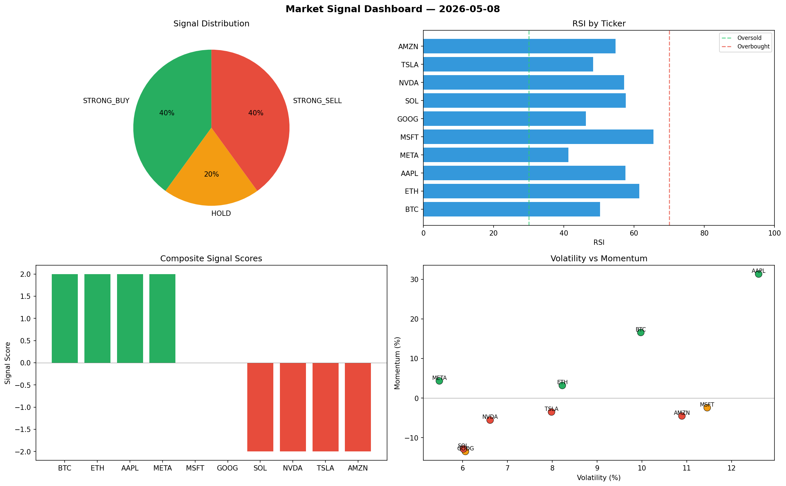

# Market Signal Report — 2026-05-08

**Run ID:** `fd9d48d8fc` | **Buy:** 4 | **Sell:** 4 | **Hold:** 2

## Signal Dashboard

| Ticker | Price | Signal | Score | RSI | Momentum | Confidence |
|--------|-------|--------|-------|-----|----------|------------|
| BTC | $1086.08 | **STRONG_BUY** | 2 | 50.27 | 0.1657 | 0.5 |
| ETH | $3671.6 | **STRONG_BUY** | 2 | 61.5 | 0.0318 | 0.5 |
| AAPL | $1193.89 | **STRONG_BUY** | 2 | 57.54 | 0.3134 | 0.5 |
| META | $4201.03 | **STRONG_BUY** | 2 | 41.32 | 0.0433 | 0.5 |
| MSFT | $2792.27 | **HOLD** | 0 | 65.51 | -0.0244 | 0.0 |
| GOOG | $1556.11 | **HOLD** | 0 | 46.25 | -0.135 | 0.0 |
| SOL | $1702.28 | **STRONG_SELL** | -2 | 57.64 | -0.1285 | 0.5 |
| NVDA | $3754.0 | **STRONG_SELL** | -2 | 57.19 | -0.0557 | 0.5 |
| TSLA | $2530.13 | **STRONG_SELL** | -2 | 48.31 | -0.0352 | 0.5 |
| AMZN | $2640.66 | **STRONG_SELL** | -2 | 54.73 | -0.0453 | 0.5 |

## Delta vs Yesterday

| Ticker | Today | Yesterday | Price Change | Signal Changed |
|--------|-------|-----------|-------------|----------------|
| BTC | STRONG_BUY | STRONG_SELL | 📉 -69.36% | ⚠️ YES |
| ETH | STRONG_BUY | STRONG_SELL | 📈 82.29% | ⚠️ YES |
| AAPL | STRONG_BUY | STRONG_SELL | 📉 -68.29% | ⚠️ YES |
| META | STRONG_BUY | SELL | 📈 550.41% | ⚠️ YES |
| MSFT | HOLD | HOLD | 📈 177.66% | — |
| GOOG | HOLD | BUY | 📉 -60.4% | ⚠️ YES |
| SOL | STRONG_SELL | STRONG_BUY | 📈 443.93% | ⚠️ YES |
| NVDA | STRONG_SELL | STRONG_SELL | 📈 9.62% | — |
| TSLA | STRONG_SELL | HOLD | 📈 301.27% | ⚠️ YES |
| AMZN | STRONG_SELL | STRONG_SELL | 📈 110.17% | — |