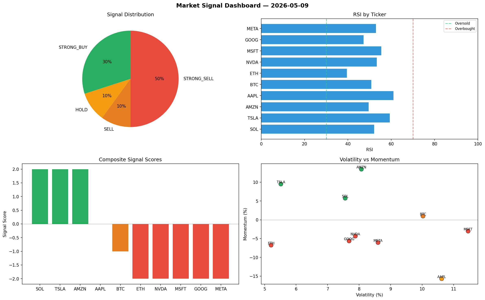

# Market Signal Report — 2026-05-09

**Run ID:** `7c165ce85a` | **Buy:** 3 | **Sell:** 6 | **Hold:** 1

## Signal Dashboard

| Ticker | Price | Signal | Score | RSI | Momentum | Confidence |
|--------|-------|--------|-------|-----|----------|------------|
| SOL | $519.91 | **STRONG_BUY** | 2 | 52.05 | 0.0574 | 0.5 |
| TSLA | $2779.91 | **STRONG_BUY** | 2 | 59.35 | 0.0951 | 0.5 |
| AMZN | $4021.62 | **STRONG_BUY** | 2 | 49.57 | 0.1347 | 0.5 |
| AAPL | $515.58 | **HOLD** | 0 | 61.02 | -0.1568 | 0.0 |
| BTC | $4696.65 | **SELL** | -1 | 50.78 | 0.0098 | 0.25 |
| ETH | $390.13 | **STRONG_SELL** | -2 | 39.48 | -0.0676 | 0.5 |
| NVDA | $696.72 | **STRONG_SELL** | -2 | 53.28 | -0.0434 | 0.5 |
| MSFT | $3090.84 | **STRONG_SELL** | -2 | 55.38 | -0.0302 | 0.5 |
| GOOG | $2296.24 | **STRONG_SELL** | -2 | 47.21 | -0.0564 | 0.5 |
| META | $401.72 | **STRONG_SELL** | -2 | 52.91 | -0.0606 | 0.5 |

## Delta vs Yesterday

| Ticker | Today | Yesterday | Price Change | Signal Changed |
|--------|-------|-----------|-------------|----------------|
| SOL | STRONG_BUY | STRONG_SELL | 📉 -36.29% | ⚠️ YES |
| TSLA | STRONG_BUY | SELL | 📉 -19.42% | ⚠️ YES |
| AMZN | STRONG_BUY | BUY | 📈 1704.71% | ⚠️ YES |
| AAPL | HOLD | BUY | 📉 -79.46% | ⚠️ YES |
| BTC | SELL | STRONG_SELL | 📈 24.45% | ⚠️ YES |
| ETH | STRONG_SELL | STRONG_SELL | 📉 -92.09% | — |
| NVDA | STRONG_SELL | STRONG_SELL | 📉 -84.09% | — |
| MSFT | STRONG_SELL | STRONG_SELL | 📈 317.39% | — |
| GOOG | STRONG_SELL | BUY | 📉 -48.78% | ⚠️ YES |
| META | STRONG_SELL | HOLD | 📉 -88.81% | ⚠️ YES |