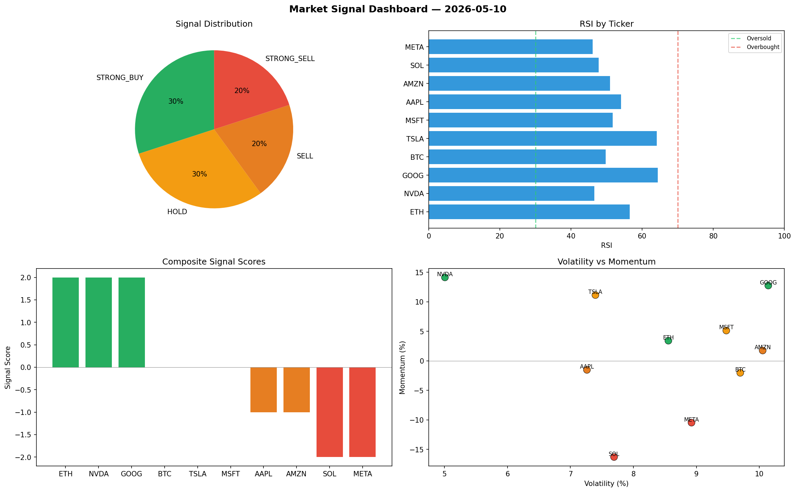

# Market Signal Report — 2026-05-10

**Run ID:** `86ce6b7c98` | **Buy:** 3 | **Sell:** 4 | **Hold:** 3

## Signal Dashboard

| Ticker | Price | Signal | Score | RSI | Momentum | Confidence |
|--------|-------|--------|-------|-----|----------|------------|
| ETH | $2219.44 | **STRONG_BUY** | 2 | 56.49 | 0.0341 | 0.5 |
| NVDA | $4669.14 | **STRONG_BUY** | 2 | 46.54 | 0.1413 | 0.5 |
| GOOG | $5706.95 | **STRONG_BUY** | 2 | 64.39 | 0.1275 | 0.5 |
| BTC | $1567.44 | **HOLD** | 0 | 49.76 | -0.0203 | 0.0 |
| TSLA | $4289.6 | **HOLD** | 0 | 64.12 | 0.1114 | 0.0 |
| MSFT | $321.22 | **HOLD** | 0 | 51.71 | 0.0513 | 0.0 |
| AAPL | $3825.27 | **SELL** | -1 | 54.08 | -0.0153 | 0.25 |
| AMZN | $113.49 | **SELL** | -1 | 50.96 | 0.0175 | 0.25 |
| SOL | $236.88 | **STRONG_SELL** | -2 | 47.76 | -0.1629 | 0.5 |
| META | $2052.8 | **STRONG_SELL** | -2 | 46.11 | -0.1047 | 0.5 |

## Delta vs Yesterday

| Ticker | Today | Yesterday | Price Change | Signal Changed |
|--------|-------|-----------|-------------|----------------|
| ETH | STRONG_BUY | STRONG_BUY | 📈 3.09% | — |
| NVDA | STRONG_BUY | STRONG_SELL | 📈 138.34% | ⚠️ YES |
| GOOG | STRONG_BUY | SELL | 📈 475.2% | ⚠️ YES |
| BTC | HOLD | STRONG_BUY | 📉 -59.17% | ⚠️ YES |
| TSLA | HOLD | BUY | 📈 9.87% | ⚠️ YES |
| MSFT | HOLD | SELL | 📉 -92.62% | ⚠️ YES |
| AAPL | SELL | HOLD | 📈 173.92% | ⚠️ YES |
| AMZN | SELL | STRONG_BUY | 📉 -59.45% | ⚠️ YES |
| SOL | STRONG_SELL | STRONG_SELL | 📉 -93.99% | — |
| META | STRONG_SELL | STRONG_BUY | 📈 57.01% | ⚠️ YES |