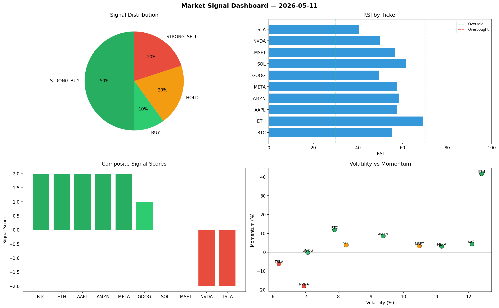

# Market Signal Report — 2026-05-11

**Run ID:** `5729a47acc` | **Buy:** 6 | **Sell:** 2 | **Hold:** 2

## Signal Dashboard

| Ticker | Price | Signal | Score | RSI | Momentum | Confidence |
|--------|-------|--------|-------|-----|----------|------------|
| BTC | $922.32 | **STRONG_BUY** | 2 | 55.28 | 0.1192 | 0.5 |
| ETH | $4189.78 | **STRONG_BUY** | 2 | 68.96 | 0.4174 | 0.5 |
| AAPL | $1775.26 | **STRONG_BUY** | 2 | 57.56 | 0.043 | 0.5 |
| AMZN | $4138.18 | **STRONG_BUY** | 2 | 58.26 | 0.0861 | 0.5 |
| META | $3931.22 | **STRONG_BUY** | 2 | 57.33 | 0.0312 | 0.5 |
| GOOG | $4387.22 | **BUY** | 1 | 49.51 | -0.0012 | 0.25 |
| SOL | $2484.16 | **HOLD** | 0 | 61.59 | 0.0379 | 0.0 |
| MSFT | $164.82 | **HOLD** | 0 | 56.59 | 0.0334 | 0.0 |
| NVDA | $1427.41 | **STRONG_SELL** | -2 | 49.91 | -0.1805 | 0.5 |
| TSLA | $4145.82 | **STRONG_SELL** | -2 | 40.67 | -0.0616 | 0.5 |

## Delta vs Yesterday

| Ticker | Today | Yesterday | Price Change | Signal Changed |
|--------|-------|-----------|-------------|----------------|
| BTC | STRONG_BUY | STRONG_BUY | 📉 -76.27% | — |
| ETH | STRONG_BUY | STRONG_SELL | 📈 141.57% | ⚠️ YES |
| AAPL | STRONG_BUY | SELL | 📉 -59.62% | ⚠️ YES |
| AMZN | STRONG_BUY | HOLD | 📉 -5.7% | ⚠️ YES |
| META | STRONG_BUY | HOLD | 📉 -26.56% | ⚠️ YES |
| GOOG | BUY | STRONG_BUY | 📈 38.8% | ⚠️ YES |
| SOL | HOLD | STRONG_SELL | 📈 95.15% | ⚠️ YES |
| MSFT | HOLD | STRONG_SELL | 📉 -93.91% | ⚠️ YES |
| NVDA | STRONG_SELL | STRONG_SELL | 📈 7.31% | — |
| TSLA | STRONG_SELL | HOLD | 📉 -5.77% | ⚠️ YES |