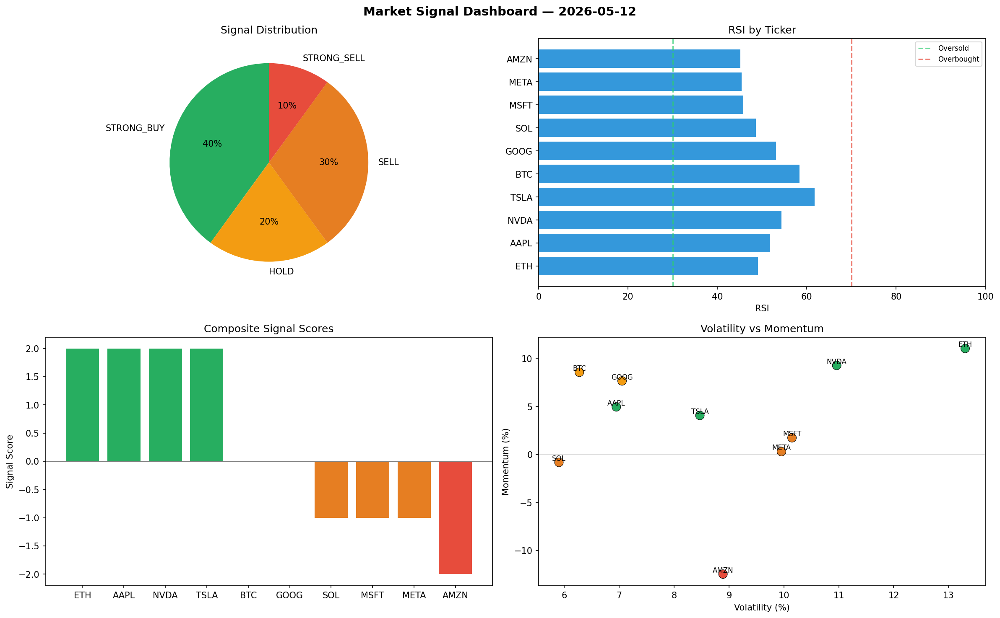

# Market Signal Report — 2026-05-12

**Run ID:** `603a1068f2` | **Buy:** 4 | **Sell:** 4 | **Hold:** 2

## Signal Dashboard

| Ticker | Price | Signal | Score | RSI | Momentum | Confidence |
|--------|-------|--------|-------|-----|----------|------------|
| ETH | $1693.74 | **STRONG_BUY** | 2 | 49.13 | 0.1104 | 0.5 |
| AAPL | $1644.55 | **STRONG_BUY** | 2 | 51.69 | 0.0495 | 0.5 |
| NVDA | $3063.0 | **STRONG_BUY** | 2 | 54.3 | 0.0927 | 0.5 |
| TSLA | $3431.17 | **STRONG_BUY** | 2 | 61.79 | 0.0406 | 0.5 |
| BTC | $1408.8 | **HOLD** | 0 | 58.41 | 0.0856 | 0.0 |
| GOOG | $2209.73 | **HOLD** | 0 | 53.11 | 0.0766 | 0.0 |
| SOL | $4338.27 | **SELL** | -1 | 48.66 | -0.0083 | 0.25 |
| MSFT | $4357.54 | **SELL** | -1 | 45.79 | 0.0173 | 0.25 |
| META | $2445.87 | **SELL** | -1 | 45.46 | 0.0029 | 0.25 |
| AMZN | $4593.72 | **STRONG_SELL** | -2 | 45.14 | -0.1247 | 0.5 |

## Delta vs Yesterday

| Ticker | Today | Yesterday | Price Change | Signal Changed |
|--------|-------|-----------|-------------|----------------|
| ETH | STRONG_BUY | STRONG_BUY | 📈 220.98% | — |
| AAPL | STRONG_BUY | STRONG_SELL | 📈 240.92% | ⚠️ YES |
| NVDA | STRONG_BUY | STRONG_BUY | 📉 -24.2% | — |
| TSLA | STRONG_BUY | STRONG_BUY | 📈 215.23% | — |
| BTC | HOLD | BUY | 📉 -57.34% | ⚠️ YES |
| GOOG | HOLD | STRONG_BUY | 📉 -51.45% | ⚠️ YES |
| SOL | SELL | STRONG_SELL | 📈 94.7% | ⚠️ YES |
| MSFT | SELL | STRONG_SELL | 📈 45.51% | ⚠️ YES |
| META | SELL | SELL | 📉 -37.82% | — |
| AMZN | STRONG_SELL | STRONG_SELL | 📈 66.01% | — |