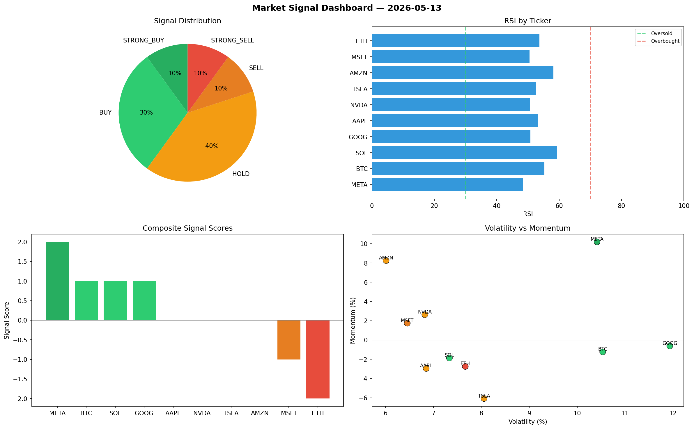

# Market Signal Report — 2026-05-13

**Run ID:** `9a9e86d3d4` | **Buy:** 4 | **Sell:** 2 | **Hold:** 4

## Signal Dashboard

| Ticker | Price | Signal | Score | RSI | Momentum | Confidence |
|--------|-------|--------|-------|-----|----------|------------|
| META | $2678.22 | **STRONG_BUY** | 2 | 48.43 | 0.1019 | 0.5 |
| BTC | $2933.16 | **BUY** | 1 | 55.3 | -0.0124 | 0.25 |
| SOL | $4866.94 | **BUY** | 1 | 59.3 | -0.0187 | 0.25 |
| GOOG | $3954.44 | **BUY** | 1 | 50.79 | -0.0062 | 0.25 |
| AAPL | $4181.44 | **HOLD** | 0 | 53.24 | -0.0296 | 0.0 |
| NVDA | $4699.36 | **HOLD** | 0 | 50.69 | 0.0263 | 0.0 |
| TSLA | $2148.82 | **HOLD** | 0 | 52.6 | -0.0608 | 0.0 |
| AMZN | $4125.42 | **HOLD** | 0 | 58.12 | 0.0825 | 0.0 |
| MSFT | $4096.62 | **SELL** | -1 | 50.47 | 0.0174 | 0.25 |
| ETH | $1335.54 | **STRONG_SELL** | -2 | 53.68 | -0.0275 | 0.5 |

## Delta vs Yesterday

| Ticker | Today | Yesterday | Price Change | Signal Changed |
|--------|-------|-----------|-------------|----------------|
| META | STRONG_BUY | STRONG_BUY | 📈 226.95% | — |
| BTC | BUY | HOLD | 📈 187.18% | ⚠️ YES |
| SOL | BUY | SELL | 📈 352.84% | ⚠️ YES |
| GOOG | BUY | STRONG_SELL | 📈 90.42% | ⚠️ YES |
| AAPL | HOLD | BUY | 📈 24.15% | ⚠️ YES |
| NVDA | HOLD | STRONG_SELL | 📈 26.95% | ⚠️ YES |
| TSLA | HOLD | HOLD | 📉 -55.38% | — |
| AMZN | HOLD | HOLD | 📈 127.85% | — |
| MSFT | SELL | STRONG_BUY | 📈 50.18% | ⚠️ YES |
| ETH | STRONG_SELL | HOLD | 📈 291.14% | ⚠️ YES |