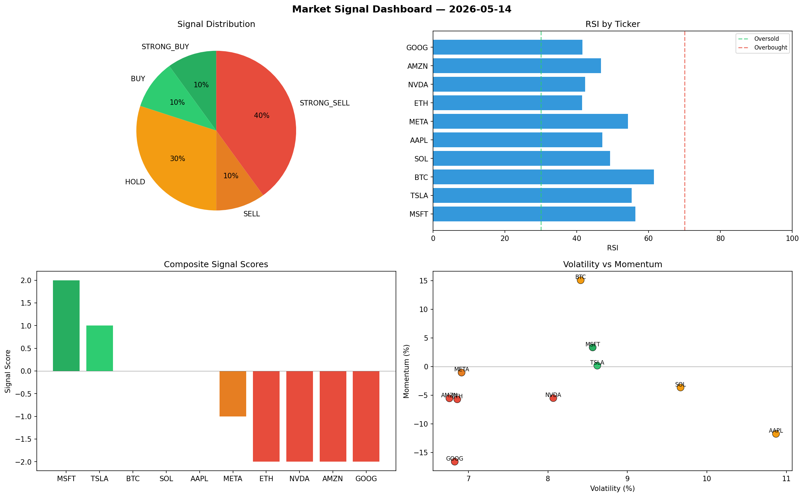

# Market Signal Report — 2026-05-14

**Run ID:** `ac4706a1ee` | **Buy:** 2 | **Sell:** 5 | **Hold:** 3

## Signal Dashboard

| Ticker | Price | Signal | Score | RSI | Momentum | Confidence |
|--------|-------|--------|-------|-----|----------|------------|
| MSFT | $916.46 | **STRONG_BUY** | 2 | 56.31 | 0.0333 | 0.5 |
| TSLA | $1324.51 | **BUY** | 1 | 55.3 | 0.0015 | 0.25 |
| BTC | $5606.14 | **HOLD** | 0 | 61.49 | 0.1505 | 0.0 |
| SOL | $4017.76 | **HOLD** | 0 | 49.23 | -0.0366 | 0.0 |
| AAPL | $4069.3 | **HOLD** | 0 | 47.11 | -0.1175 | 0.0 |
| META | $402.77 | **SELL** | -1 | 54.28 | -0.0106 | 0.25 |
| ETH | $1071.52 | **STRONG_SELL** | -2 | 41.45 | -0.0572 | 0.5 |
| NVDA | $3325.14 | **STRONG_SELL** | -2 | 42.31 | -0.0551 | 0.5 |
| AMZN | $2957.47 | **STRONG_SELL** | -2 | 46.72 | -0.0555 | 0.5 |
| GOOG | $3241.42 | **STRONG_SELL** | -2 | 41.62 | -0.166 | 0.5 |

## Delta vs Yesterday

| Ticker | Today | Yesterday | Price Change | Signal Changed |
|--------|-------|-----------|-------------|----------------|
| MSFT | STRONG_BUY | HOLD | 📉 -34.68% | ⚠️ YES |
| TSLA | BUY | STRONG_SELL | 📈 120.06% | ⚠️ YES |
| BTC | HOLD | SELL | 📈 19.89% | ⚠️ YES |
| SOL | HOLD | HOLD | 📈 42.21% | — |
| AAPL | HOLD | HOLD | 📈 58.84% | — |
| META | SELL | BUY | 📉 -77.35% | ⚠️ YES |
| ETH | STRONG_SELL | STRONG_SELL | 📉 -63.41% | — |
| NVDA | STRONG_SELL | HOLD | 📈 147.61% | ⚠️ YES |
| AMZN | STRONG_SELL | STRONG_SELL | 📈 24.14% | — |
| GOOG | STRONG_SELL | STRONG_SELL | 📈 103.7% | — |