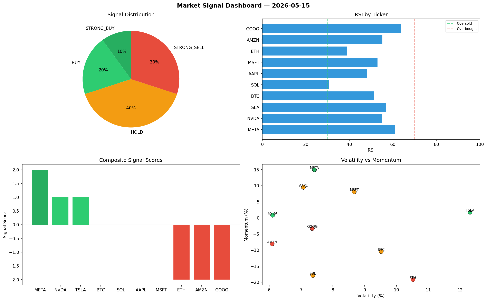

# Market Signal Report — 2026-05-15

**Run ID:** `d9b8df6ab4` | **Buy:** 3 | **Sell:** 3 | **Hold:** 4

## Signal Dashboard

| Ticker | Price | Signal | Score | RSI | Momentum | Confidence |
|--------|-------|--------|-------|-----|----------|------------|
| META | $3229.83 | **STRONG_BUY** | 2 | 61.1 | 0.1496 | 0.5 |
| NVDA | $323.06 | **BUY** | 1 | 54.88 | 0.0081 | 0.25 |
| TSLA | $2488.37 | **BUY** | 1 | 56.77 | 0.0174 | 0.25 |
| BTC | $2791.17 | **HOLD** | 0 | 51.36 | -0.1047 | 0.0 |
| SOL | $318.06 | **HOLD** | 0 | 30.68 | -0.1791 | 0.0 |
| AAPL | $3322.55 | **HOLD** | 0 | 47.92 | 0.0948 | 0.0 |
| MSFT | $2598.85 | **HOLD** | 0 | 52.91 | 0.0811 | 0.0 |
| ETH | $2657.44 | **STRONG_SELL** | -2 | 38.73 | -0.1919 | 0.5 |
| AMZN | $163.42 | **STRONG_SELL** | -2 | 55.17 | -0.0809 | 0.5 |
| GOOG | $2477.61 | **STRONG_SELL** | -2 | 63.81 | -0.0331 | 0.5 |

## Delta vs Yesterday

| Ticker | Today | Yesterday | Price Change | Signal Changed |
|--------|-------|-----------|-------------|----------------|
| META | STRONG_BUY | SELL | 📈 701.9% | ⚠️ YES |
| NVDA | BUY | STRONG_SELL | 📉 -90.28% | ⚠️ YES |
| TSLA | BUY | BUY | 📈 87.87% | — |
| BTC | HOLD | HOLD | 📉 -50.21% | — |
| SOL | HOLD | HOLD | 📉 -92.08% | — |
| AAPL | HOLD | HOLD | 📉 -18.35% | — |
| MSFT | HOLD | STRONG_BUY | 📈 183.57% | ⚠️ YES |
| ETH | STRONG_SELL | STRONG_SELL | 📈 148.01% | — |
| AMZN | STRONG_SELL | STRONG_SELL | 📉 -94.47% | — |
| GOOG | STRONG_SELL | STRONG_SELL | 📉 -23.56% | — |