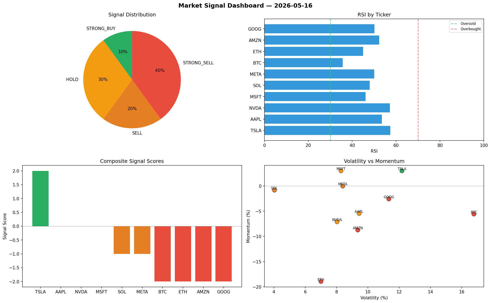

# Market Signal Report — 2026-05-16

**Run ID:** `00f2cca0c2` | **Buy:** 1 | **Sell:** 6 | **Hold:** 3

## Signal Dashboard

| Ticker | Price | Signal | Score | RSI | Momentum | Confidence |
|--------|-------|--------|-------|-----|----------|------------|
| TSLA | $1828.74 | **STRONG_BUY** | 2 | 57.36 | 0.03 | 0.5 |
| AAPL | $154.96 | **HOLD** | 0 | 53.52 | -0.0545 | 0.0 |
| NVDA | $2626.16 | **HOLD** | 0 | 57.2 | -0.071 | 0.0 |
| MSFT | $187.25 | **HOLD** | 0 | 46.09 | 0.03 | 0.0 |
| SOL | $114.68 | **SELL** | -1 | 47.98 | -0.0083 | 0.25 |
| META | $2360.45 | **SELL** | -1 | 50.0 | -0.0002 | 0.25 |
| BTC | $127.09 | **STRONG_SELL** | -2 | 35.69 | -0.0557 | 0.5 |
| ETH | $3713.05 | **STRONG_SELL** | -2 | 44.99 | -0.1893 | 0.5 |
| AMZN | $438.37 | **STRONG_SELL** | -2 | 52.31 | -0.0873 | 0.5 |
| GOOG | $382.33 | **STRONG_SELL** | -2 | 50.08 | -0.0258 | 0.5 |

## Delta vs Yesterday

| Ticker | Today | Yesterday | Price Change | Signal Changed |
|--------|-------|-----------|-------------|----------------|
| TSLA | STRONG_BUY | STRONG_BUY | 📈 128.2% | — |
| AAPL | HOLD | STRONG_SELL | 📉 -77.18% | ⚠️ YES |
| NVDA | HOLD | STRONG_BUY | 📉 -32.4% | ⚠️ YES |
| MSFT | HOLD | STRONG_SELL | 📉 -95.08% | ⚠️ YES |
| SOL | SELL | STRONG_BUY | 📉 -94.12% | ⚠️ YES |
| META | SELL | HOLD | 📉 -10.31% | ⚠️ YES |
| BTC | STRONG_SELL | STRONG_SELL | 📉 -97.1% | — |
| ETH | STRONG_SELL | SELL | 📈 402.26% | ⚠️ YES |
| AMZN | STRONG_SELL | SELL | 📉 -88.98% | ⚠️ YES |
| GOOG | STRONG_SELL | STRONG_SELL | 📉 -83.31% | — |