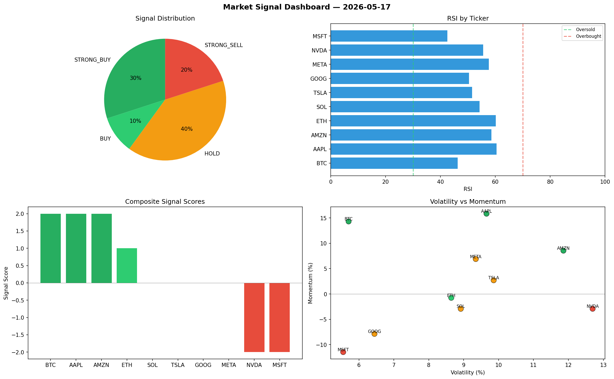

# Market Signal Report — 2026-05-17

**Run ID:** `900c56c9a4` | **Buy:** 4 | **Sell:** 2 | **Hold:** 4

## Signal Dashboard

| Ticker | Price | Signal | Score | RSI | Momentum | Confidence |
|--------|-------|--------|-------|-----|----------|------------|
| BTC | $4117.52 | **STRONG_BUY** | 2 | 46.25 | 0.143 | 0.5 |
| AAPL | $4324.04 | **STRONG_BUY** | 2 | 60.44 | 0.1583 | 0.5 |
| AMZN | $3200.12 | **STRONG_BUY** | 2 | 58.61 | 0.0854 | 0.5 |
| ETH | $3877.31 | **BUY** | 1 | 60.15 | -0.0076 | 0.25 |
| SOL | $2391.97 | **HOLD** | 0 | 54.2 | -0.0293 | 0.0 |
| TSLA | $1607.58 | **HOLD** | 0 | 51.55 | 0.027 | 0.0 |
| GOOG | $3134.94 | **HOLD** | 0 | 50.43 | -0.0787 | 0.0 |
| META | $1678.7 | **HOLD** | 0 | 57.65 | 0.0689 | 0.0 |
| NVDA | $85.7 | **STRONG_SELL** | -2 | 55.58 | -0.0292 | 0.5 |
| MSFT | $3239.65 | **STRONG_SELL** | -2 | 42.49 | -0.1146 | 0.5 |

## Delta vs Yesterday

| Ticker | Today | Yesterday | Price Change | Signal Changed |
|--------|-------|-----------|-------------|----------------|
| BTC | STRONG_BUY | STRONG_SELL | 📈 3139.85% | ⚠️ YES |
| AAPL | STRONG_BUY | HOLD | 📈 2690.42% | ⚠️ YES |
| AMZN | STRONG_BUY | STRONG_SELL | 📈 630.0% | ⚠️ YES |
| ETH | BUY | STRONG_SELL | 📈 4.42% | ⚠️ YES |
| SOL | HOLD | SELL | 📈 1985.78% | ⚠️ YES |
| TSLA | HOLD | STRONG_BUY | 📉 -12.09% | ⚠️ YES |
| GOOG | HOLD | STRONG_SELL | 📈 719.96% | ⚠️ YES |
| META | HOLD | SELL | 📉 -28.88% | ⚠️ YES |
| NVDA | STRONG_SELL | HOLD | 📉 -96.74% | ⚠️ YES |
| MSFT | STRONG_SELL | HOLD | 📈 1630.12% | ⚠️ YES |