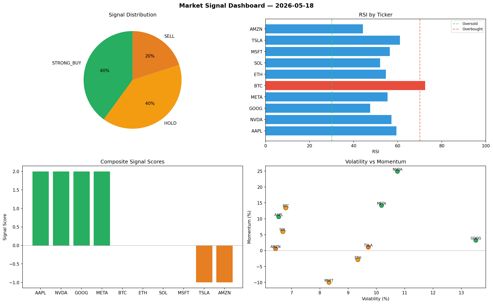

# Market Signal Report — 2026-05-18

**Run ID:** `590f7f747b` | **Buy:** 4 | **Sell:** 2 | **Hold:** 4

## Signal Dashboard

| Ticker | Price | Signal | Score | RSI | Momentum | Confidence |
|--------|-------|--------|-------|-----|----------|------------|
| AAPL | $4578.29 | **STRONG_BUY** | 2 | 59.39 | 0.1063 | 0.5 |
| NVDA | $1172.7 | **STRONG_BUY** | 2 | 57.11 | 0.249 | 0.5 |
| GOOG | $4301.76 | **STRONG_BUY** | 2 | 47.5 | 0.0324 | 0.5 |
| META | $1907.91 | **STRONG_BUY** | 2 | 55.33 | 0.142 | 0.5 |
| BTC | $3859.51 | **HOLD** | 0 | 72.42 | 0.1342 | 0.0 |
| ETH | $1652.83 | **HOLD** | 0 | 54.6 | -0.0284 | 0.0 |
| SOL | $4002.71 | **HOLD** | 0 | 52.03 | 0.0597 | 0.0 |
| MSFT | $4707.83 | **HOLD** | 0 | 56.36 | -0.0999 | 0.0 |
| TSLA | $2431.53 | **SELL** | -1 | 60.97 | 0.0108 | 0.25 |
| AMZN | $4054.53 | **SELL** | -1 | 44.2 | 0.006 | 0.25 |

## Delta vs Yesterday

| Ticker | Today | Yesterday | Price Change | Signal Changed |
|--------|-------|-----------|-------------|----------------|
| AAPL | STRONG_BUY | STRONG_BUY | 📈 254.07% | — |
| NVDA | STRONG_BUY | HOLD | 📉 -73.95% | ⚠️ YES |
| GOOG | STRONG_BUY | STRONG_BUY | 📈 65.87% | — |
| META | STRONG_BUY | HOLD | 📉 -13.49% | ⚠️ YES |
| BTC | HOLD | HOLD | 📈 30.37% | — |
| ETH | HOLD | HOLD | 📈 349.0% | — |
| SOL | HOLD | SELL | 📈 55.23% | ⚠️ YES |
| MSFT | HOLD | STRONG_BUY | 📈 4759.95% | ⚠️ YES |
| TSLA | SELL | BUY | 📉 -21.74% | ⚠️ YES |
| AMZN | SELL | HOLD | 📈 465.31% | ⚠️ YES |