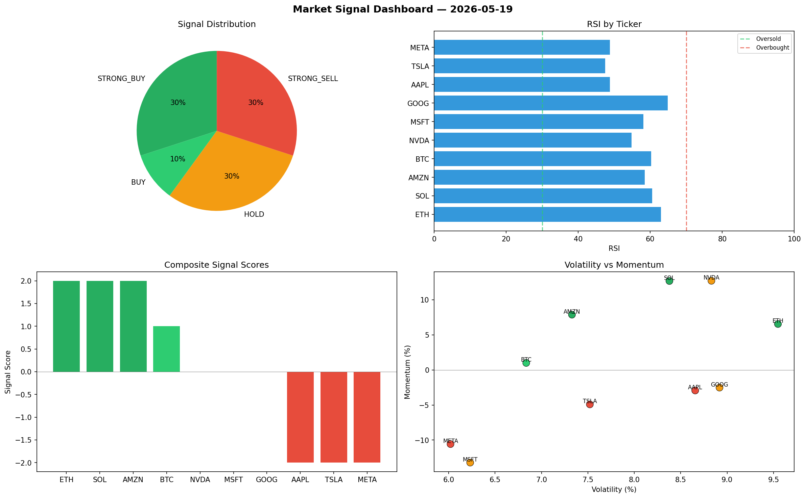

# Market Signal Report — 2026-05-19

**Run ID:** `589bcdcc21` | **Buy:** 4 | **Sell:** 3 | **Hold:** 3

## Signal Dashboard

| Ticker | Price | Signal | Score | RSI | Momentum | Confidence |
|--------|-------|--------|-------|-----|----------|------------|
| ETH | $1494.83 | **STRONG_BUY** | 2 | 62.94 | 0.0655 | 0.5 |
| SOL | $924.48 | **STRONG_BUY** | 2 | 60.54 | 0.1268 | 0.5 |
| AMZN | $2162.02 | **STRONG_BUY** | 2 | 58.5 | 0.0788 | 0.5 |
| BTC | $2002.94 | **BUY** | 1 | 60.27 | 0.01 | 0.25 |
| NVDA | $2071.4 | **HOLD** | 0 | 54.77 | 0.1271 | 0.0 |
| MSFT | $2649.57 | **HOLD** | 0 | 58.13 | -0.1321 | 0.0 |
| GOOG | $3720.86 | **HOLD** | 0 | 64.88 | -0.0252 | 0.0 |
| AAPL | $2664.39 | **STRONG_SELL** | -2 | 48.79 | -0.0293 | 0.5 |
| TSLA | $2736.97 | **STRONG_SELL** | -2 | 47.52 | -0.0491 | 0.5 |
| META | $821.28 | **STRONG_SELL** | -2 | 48.82 | -0.1057 | 0.5 |

## Delta vs Yesterday

| Ticker | Today | Yesterday | Price Change | Signal Changed |
|--------|-------|-----------|-------------|----------------|
| ETH | STRONG_BUY | BUY | 📉 -60.13% | ⚠️ YES |
| SOL | STRONG_BUY | BUY | 📉 -77.86% | ⚠️ YES |
| AMZN | STRONG_BUY | STRONG_SELL | 📉 -33.46% | ⚠️ YES |
| BTC | BUY | HOLD | 📈 786.34% | ⚠️ YES |
| NVDA | HOLD | STRONG_BUY | 📈 16.79% | ⚠️ YES |
| MSFT | HOLD | STRONG_BUY | 📉 -35.78% | ⚠️ YES |
| GOOG | HOLD | STRONG_SELL | 📈 112.63% | ⚠️ YES |
| AAPL | STRONG_SELL | HOLD | 📈 257.6% | ⚠️ YES |
| TSLA | STRONG_SELL | HOLD | 📉 -37.11% | ⚠️ YES |
| META | STRONG_SELL | HOLD | 📉 -77.94% | ⚠️ YES |