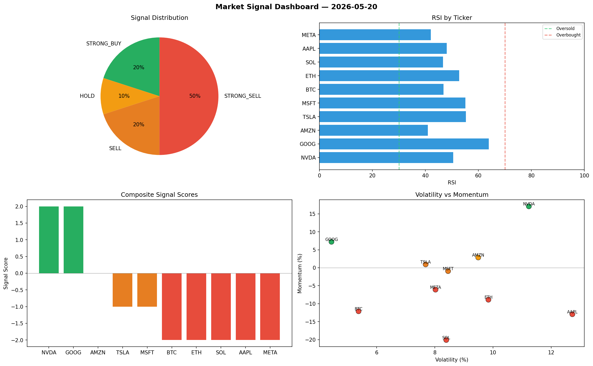

# Market Signal Report — 2026-05-20

**Run ID:** `f3e163aaa6` | **Buy:** 2 | **Sell:** 7 | **Hold:** 1

## Signal Dashboard

| Ticker | Price | Signal | Score | RSI | Momentum | Confidence |
|--------|-------|--------|-------|-----|----------|------------|
| NVDA | $2277.67 | **STRONG_BUY** | 2 | 50.52 | 0.1707 | 0.5 |
| GOOG | $3853.2 | **STRONG_BUY** | 2 | 63.92 | 0.0721 | 0.5 |
| AMZN | $3559.67 | **HOLD** | 0 | 40.88 | 0.0285 | 0.0 |
| TSLA | $3633.1 | **SELL** | -1 | 55.28 | 0.0093 | 0.25 |
| MSFT | $3013.14 | **SELL** | -1 | 55.09 | -0.0094 | 0.25 |
| BTC | $2572.33 | **STRONG_SELL** | -2 | 46.84 | -0.1211 | 0.5 |
| ETH | $1562.43 | **STRONG_SELL** | -2 | 52.73 | -0.089 | 0.5 |
| SOL | $309.31 | **STRONG_SELL** | -2 | 46.67 | -0.201 | 0.5 |
| AAPL | $2633.44 | **STRONG_SELL** | -2 | 48.01 | -0.1294 | 0.5 |
| META | $3293.49 | **STRONG_SELL** | -2 | 42.09 | -0.061 | 0.5 |

## Delta vs Yesterday

| Ticker | Today | Yesterday | Price Change | Signal Changed |
|--------|-------|-----------|-------------|----------------|
| NVDA | STRONG_BUY | HOLD | 📈 9.96% | ⚠️ YES |
| GOOG | STRONG_BUY | HOLD | 📈 3.56% | ⚠️ YES |
| AMZN | HOLD | STRONG_BUY | 📈 64.65% | ⚠️ YES |
| TSLA | SELL | STRONG_SELL | 📈 32.74% | ⚠️ YES |
| MSFT | SELL | HOLD | 📈 13.72% | ⚠️ YES |
| BTC | STRONG_SELL | BUY | 📈 28.43% | ⚠️ YES |
| ETH | STRONG_SELL | STRONG_BUY | 📈 4.52% | ⚠️ YES |
| SOL | STRONG_SELL | STRONG_BUY | 📉 -66.54% | ⚠️ YES |
| AAPL | STRONG_SELL | STRONG_SELL | 📉 -1.16% | — |
| META | STRONG_SELL | STRONG_SELL | 📈 301.02% | — |