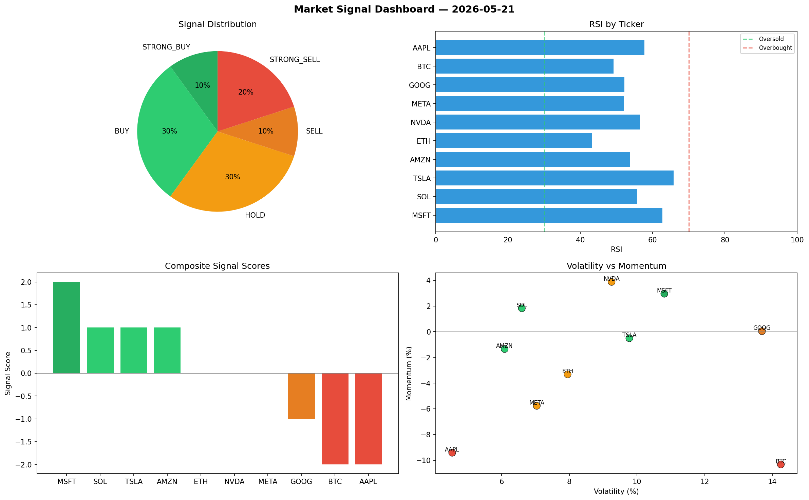

# Market Signal Report — 2026-05-21

**Run ID:** `135da34443` | **Buy:** 4 | **Sell:** 3 | **Hold:** 3

## Signal Dashboard

| Ticker | Price | Signal | Score | RSI | Momentum | Confidence |
|--------|-------|--------|-------|-----|----------|------------|
| MSFT | $2924.27 | **STRONG_BUY** | 2 | 62.65 | 0.0295 | 0.5 |
| SOL | $3091.11 | **BUY** | 1 | 55.76 | 0.0182 | 0.25 |
| TSLA | $3388.73 | **BUY** | 1 | 65.77 | -0.0051 | 0.25 |
| AMZN | $1324.39 | **BUY** | 1 | 53.77 | -0.0135 | 0.25 |
| ETH | $3487.64 | **HOLD** | 0 | 43.25 | -0.0332 | 0.0 |
| NVDA | $2223.65 | **HOLD** | 0 | 56.47 | 0.0387 | 0.0 |
| META | $4495.4 | **HOLD** | 0 | 52.08 | -0.0577 | 0.0 |
| GOOG | $4157.18 | **SELL** | -1 | 52.17 | 0.0004 | 0.25 |
| BTC | $1490.06 | **STRONG_SELL** | -2 | 49.2 | -0.1033 | 0.5 |
| AAPL | $2361.75 | **STRONG_SELL** | -2 | 57.73 | -0.0942 | 0.5 |

## Delta vs Yesterday

| Ticker | Today | Yesterday | Price Change | Signal Changed |
|--------|-------|-----------|-------------|----------------|
| MSFT | STRONG_BUY | HOLD | 📈 194.24% | ⚠️ YES |
| SOL | BUY | BUY | 📈 167.36% | — |
| TSLA | BUY | SELL | 📈 67.28% | ⚠️ YES |
| AMZN | BUY | HOLD | 📉 -58.4% | ⚠️ YES |
| ETH | HOLD | HOLD | 📈 12.38% | — |
| NVDA | HOLD | STRONG_BUY | 📉 -24.74% | ⚠️ YES |
| META | HOLD | STRONG_BUY | 📈 83.06% | ⚠️ YES |
| GOOG | SELL | SELL | 📈 1611.62% | — |
| BTC | STRONG_SELL | BUY | 📉 -55.78% | ⚠️ YES |
| AAPL | STRONG_SELL | SELL | 📈 221.81% | ⚠️ YES |