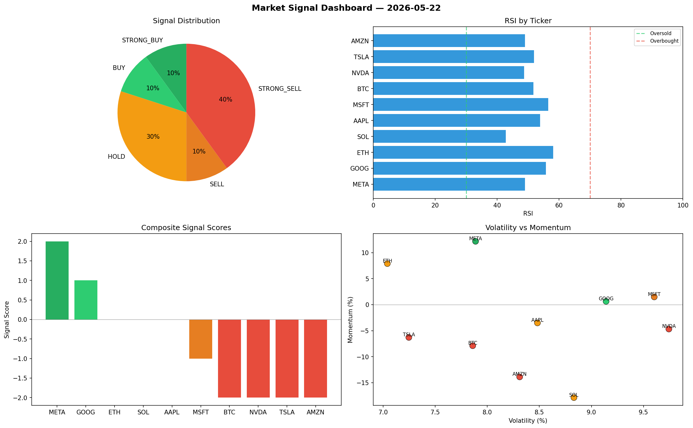

# Market Signal Report — 2026-05-22

**Run ID:** `e086607ef1` | **Buy:** 2 | **Sell:** 5 | **Hold:** 3

## Signal Dashboard

| Ticker | Price | Signal | Score | RSI | Momentum | Confidence |
|--------|-------|--------|-------|-----|----------|------------|
| META | $4731.73 | **STRONG_BUY** | 2 | 49.03 | 0.1219 | 0.5 |
| GOOG | $1725.91 | **BUY** | 1 | 55.79 | 0.0064 | 0.25 |
| ETH | $353.67 | **HOLD** | 0 | 58.05 | 0.0791 | 0.0 |
| SOL | $3769.19 | **HOLD** | 0 | 42.84 | -0.1788 | 0.0 |
| AAPL | $1631.73 | **HOLD** | 0 | 53.85 | -0.0351 | 0.0 |
| MSFT | $2410.68 | **SELL** | -1 | 56.48 | 0.0149 | 0.25 |
| BTC | $2352.36 | **STRONG_SELL** | -2 | 51.73 | -0.079 | 0.5 |
| NVDA | $4325.62 | **STRONG_SELL** | -2 | 48.71 | -0.0469 | 0.5 |
| TSLA | $461.69 | **STRONG_SELL** | -2 | 51.94 | -0.063 | 0.5 |
| AMZN | $1489.36 | **STRONG_SELL** | -2 | 48.96 | -0.139 | 0.5 |

## Delta vs Yesterday

| Ticker | Today | Yesterday | Price Change | Signal Changed |
|--------|-------|-----------|-------------|----------------|
| META | STRONG_BUY | HOLD | 📈 5.26% | ⚠️ YES |
| GOOG | BUY | SELL | 📉 -58.48% | ⚠️ YES |
| ETH | HOLD | HOLD | 📉 -89.86% | — |
| SOL | HOLD | BUY | 📈 21.94% | ⚠️ YES |
| AAPL | HOLD | STRONG_SELL | 📉 -30.91% | ⚠️ YES |
| MSFT | SELL | STRONG_BUY | 📉 -17.56% | ⚠️ YES |
| BTC | STRONG_SELL | STRONG_SELL | 📈 57.87% | — |
| NVDA | STRONG_SELL | HOLD | 📈 94.53% | ⚠️ YES |
| TSLA | STRONG_SELL | BUY | 📉 -86.38% | ⚠️ YES |
| AMZN | STRONG_SELL | BUY | 📈 12.46% | ⚠️ YES |