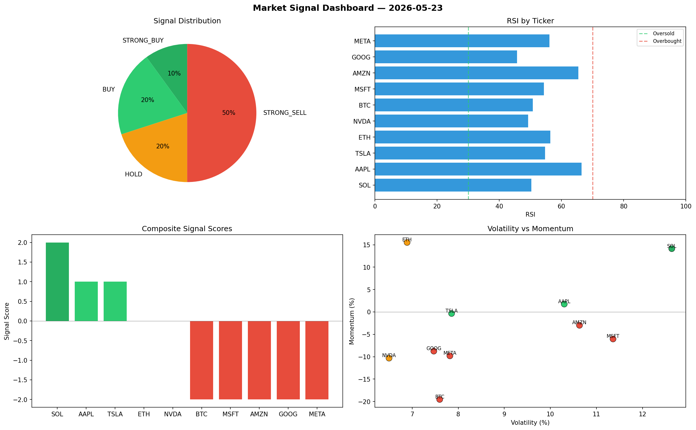

# Market Signal Report — 2026-05-23

**Run ID:** `8bffe23246` | **Buy:** 3 | **Sell:** 5 | **Hold:** 2

## Signal Dashboard

| Ticker | Price | Signal | Score | RSI | Momentum | Confidence |
|--------|-------|--------|-------|-----|----------|------------|
| SOL | $911.45 | **STRONG_BUY** | 2 | 50.27 | 0.1412 | 0.5 |
| AAPL | $5057.19 | **BUY** | 1 | 66.42 | 0.0175 | 0.25 |
| TSLA | $2774.13 | **BUY** | 1 | 54.68 | -0.0035 | 0.25 |
| ETH | $113.57 | **HOLD** | 0 | 56.38 | 0.1551 | 0.0 |
| NVDA | $2534.68 | **HOLD** | 0 | 49.31 | -0.1032 | 0.0 |
| BTC | $1250.12 | **STRONG_SELL** | -2 | 50.73 | -0.1954 | 0.5 |
| MSFT | $1471.52 | **STRONG_SELL** | -2 | 54.36 | -0.0604 | 0.5 |
| AMZN | $4137.04 | **STRONG_SELL** | -2 | 65.46 | -0.0299 | 0.5 |
| GOOG | $3527.29 | **STRONG_SELL** | -2 | 45.74 | -0.0876 | 0.5 |
| META | $975.52 | **STRONG_SELL** | -2 | 56.08 | -0.0981 | 0.5 |

## Delta vs Yesterday

| Ticker | Today | Yesterday | Price Change | Signal Changed |
|--------|-------|-----------|-------------|----------------|
| SOL | STRONG_BUY | STRONG_SELL | 📉 -67.7% | ⚠️ YES |
| AAPL | BUY | STRONG_SELL | 📈 23.9% | ⚠️ YES |
| TSLA | BUY | BUY | 📉 -10.19% | — |
| ETH | HOLD | BUY | 📉 -97.64% | ⚠️ YES |
| NVDA | HOLD | STRONG_BUY | 📈 31.83% | ⚠️ YES |
| BTC | STRONG_SELL | STRONG_SELL | 📉 -69.15% | — |
| MSFT | STRONG_SELL | HOLD | 📉 -66.16% | ⚠️ YES |
| AMZN | STRONG_SELL | HOLD | 📈 3.88% | ⚠️ YES |
| GOOG | STRONG_SELL | STRONG_SELL | 📈 1093.51% | — |
| META | STRONG_SELL | BUY | 📉 -69.13% | ⚠️ YES |