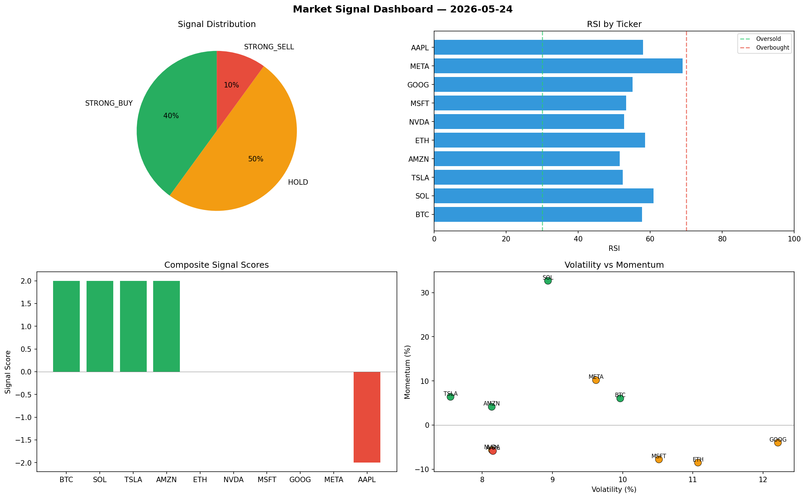

# Market Signal Report — 2026-05-24

**Run ID:** `7b962e7144` | **Buy:** 4 | **Sell:** 1 | **Hold:** 5

## Signal Dashboard

| Ticker | Price | Signal | Score | RSI | Momentum | Confidence |
|--------|-------|--------|-------|-----|----------|------------|
| BTC | $4964.26 | **STRONG_BUY** | 2 | 57.75 | 0.0603 | 0.5 |
| SOL | $1210.35 | **STRONG_BUY** | 2 | 60.93 | 0.3268 | 0.5 |
| TSLA | $1046.93 | **STRONG_BUY** | 2 | 52.37 | 0.0638 | 0.5 |
| AMZN | $2587.44 | **STRONG_BUY** | 2 | 51.53 | 0.0412 | 0.5 |
| ETH | $3272.52 | **HOLD** | 0 | 58.6 | -0.0852 | 0.0 |
| NVDA | $4192.16 | **HOLD** | 0 | 52.79 | -0.0568 | 0.0 |
| MSFT | $2849.04 | **HOLD** | 0 | 53.35 | -0.078 | 0.0 |
| GOOG | $2926.39 | **HOLD** | 0 | 55.05 | -0.04 | 0.0 |
| META | $3599.97 | **HOLD** | 0 | 68.99 | 0.1017 | 0.0 |
| AAPL | $2364.28 | **STRONG_SELL** | -2 | 58.03 | -0.0589 | 0.5 |

## Delta vs Yesterday

| Ticker | Today | Yesterday | Price Change | Signal Changed |
|--------|-------|-----------|-------------|----------------|
| BTC | STRONG_BUY | STRONG_SELL | 📈 36.54% | ⚠️ YES |
| SOL | STRONG_BUY | HOLD | 📉 -54.85% | ⚠️ YES |
| TSLA | STRONG_BUY | STRONG_BUY | 📈 61.13% | — |
| AMZN | STRONG_BUY | STRONG_SELL | 📈 66.22% | ⚠️ YES |
| ETH | HOLD | HOLD | 📈 39.11% | — |
| NVDA | HOLD | STRONG_SELL | 📈 51.99% | ⚠️ YES |
| MSFT | HOLD | HOLD | 📈 105.47% | — |
| GOOG | HOLD | STRONG_SELL | 📉 -7.06% | ⚠️ YES |
| META | HOLD | SELL | 📉 -32.94% | ⚠️ YES |
| AAPL | STRONG_SELL | BUY | 📉 -18.61% | ⚠️ YES |