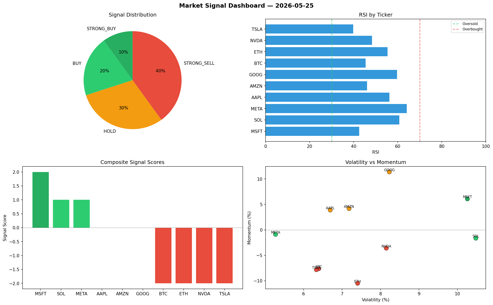

# Market Signal Report — 2026-05-25

**Run ID:** `305234f54d` | **Buy:** 3 | **Sell:** 4 | **Hold:** 3

## Signal Dashboard

| Ticker | Price | Signal | Score | RSI | Momentum | Confidence |
|--------|-------|--------|-------|-----|----------|------------|
| MSFT | $35.09 | **STRONG_BUY** | 2 | 42.53 | 0.0608 | 0.5 |
| SOL | $3835.07 | **BUY** | 1 | 60.77 | -0.0164 | 0.25 |
| META | $3639.01 | **BUY** | 1 | 64.12 | -0.0089 | 0.25 |
| AAPL | $4156.01 | **HOLD** | 0 | 56.21 | 0.0388 | 0.0 |
| AMZN | $3642.36 | **HOLD** | 0 | 46.08 | 0.0417 | 0.0 |
| GOOG | $4760.9 | **HOLD** | 0 | 59.65 | 0.1136 | 0.0 |
| BTC | $1579.26 | **STRONG_SELL** | -2 | 45.41 | -0.0764 | 0.5 |
| ETH | $4339.46 | **STRONG_SELL** | -2 | 55.35 | -0.105 | 0.5 |
| NVDA | $4540.88 | **STRONG_SELL** | -2 | 48.34 | -0.036 | 0.5 |
| TSLA | $3752.29 | **STRONG_SELL** | -2 | 39.83 | -0.0783 | 0.5 |

## Delta vs Yesterday

| Ticker | Today | Yesterday | Price Change | Signal Changed |
|--------|-------|-----------|-------------|----------------|
| MSFT | STRONG_BUY | HOLD | 📉 -98.77% | ⚠️ YES |
| SOL | BUY | STRONG_BUY | 📈 216.86% | ⚠️ YES |
| META | BUY | HOLD | 📈 1.08% | ⚠️ YES |
| AAPL | HOLD | STRONG_SELL | 📈 75.78% | ⚠️ YES |
| AMZN | HOLD | STRONG_BUY | 📈 40.77% | ⚠️ YES |
| GOOG | HOLD | HOLD | 📈 62.69% | — |
| BTC | STRONG_SELL | STRONG_BUY | 📉 -68.19% | ⚠️ YES |
| ETH | STRONG_SELL | HOLD | 📈 32.6% | ⚠️ YES |
| NVDA | STRONG_SELL | HOLD | 📈 8.32% | ⚠️ YES |
| TSLA | STRONG_SELL | STRONG_BUY | 📈 258.41% | ⚠️ YES |