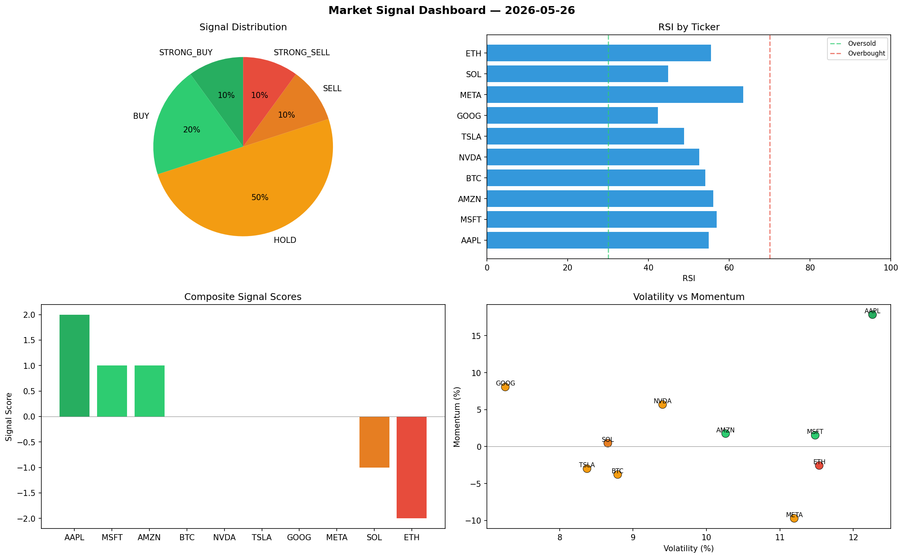

# Market Signal Report — 2026-05-26

**Run ID:** `80cec416bd` | **Buy:** 3 | **Sell:** 2 | **Hold:** 5

## Signal Dashboard

| Ticker | Price | Signal | Score | RSI | Momentum | Confidence |
|--------|-------|--------|-------|-----|----------|------------|
| AAPL | $5530.91 | **STRONG_BUY** | 2 | 54.86 | 0.1785 | 0.5 |
| MSFT | $4077.78 | **BUY** | 1 | 56.91 | 0.0153 | 0.25 |
| AMZN | $2456.93 | **BUY** | 1 | 55.99 | 0.0176 | 0.25 |
| BTC | $1619.81 | **HOLD** | 0 | 54.04 | -0.0378 | 0.0 |
| NVDA | $3115.14 | **HOLD** | 0 | 52.51 | 0.0569 | 0.0 |
| TSLA | $4760.38 | **HOLD** | 0 | 48.79 | -0.0299 | 0.0 |
| GOOG | $1396.61 | **HOLD** | 0 | 42.37 | 0.0806 | 0.0 |
| META | $2162.43 | **HOLD** | 0 | 63.48 | -0.0971 | 0.0 |
| SOL | $2364.61 | **SELL** | -1 | 44.83 | 0.0046 | 0.25 |
| ETH | $695.58 | **STRONG_SELL** | -2 | 55.5 | -0.0256 | 0.5 |

## Delta vs Yesterday

| Ticker | Today | Yesterday | Price Change | Signal Changed |
|--------|-------|-----------|-------------|----------------|
| AAPL | STRONG_BUY | HOLD | 📈 4018.63% | ⚠️ YES |
| MSFT | BUY | BUY | 📈 4.13% | — |
| AMZN | BUY | STRONG_BUY | 📉 -58.55% | ⚠️ YES |
| BTC | HOLD | HOLD | 📉 -43.51% | — |
| NVDA | HOLD | HOLD | 📈 218.96% | — |
| TSLA | HOLD | BUY | 📈 47.71% | ⚠️ YES |
| GOOG | HOLD | STRONG_BUY | 📉 -47.29% | ⚠️ YES |
| META | HOLD | STRONG_SELL | 📈 98.04% | ⚠️ YES |
| SOL | SELL | HOLD | 📉 -45.99% | ⚠️ YES |
| ETH | STRONG_SELL | STRONG_SELL | 📉 -73.02% | — |