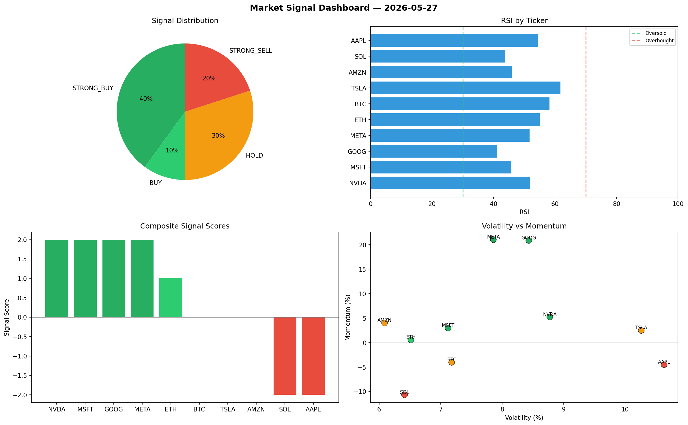

# Market Signal Report — 2026-05-27

**Run ID:** `2c58809604` | **Buy:** 5 | **Sell:** 2 | **Hold:** 3

## Signal Dashboard

| Ticker | Price | Signal | Score | RSI | Momentum | Confidence |
|--------|-------|--------|-------|-----|----------|------------|
| NVDA | $201.9 | **STRONG_BUY** | 2 | 51.9 | 0.0524 | 0.5 |
| MSFT | $1661.18 | **STRONG_BUY** | 2 | 45.77 | 0.0295 | 0.5 |
| GOOG | $713.35 | **STRONG_BUY** | 2 | 41.12 | 0.2087 | 0.5 |
| META | $5548.98 | **STRONG_BUY** | 2 | 51.71 | 0.2104 | 0.5 |
| ETH | $238.35 | **BUY** | 1 | 55.0 | 0.0057 | 0.25 |
| BTC | $4801.15 | **HOLD** | 0 | 58.21 | -0.0404 | 0.0 |
| TSLA | $1294.18 | **HOLD** | 0 | 61.76 | 0.0248 | 0.0 |
| AMZN | $113.37 | **HOLD** | 0 | 45.87 | 0.0401 | 0.0 |
| SOL | $4540.03 | **STRONG_SELL** | -2 | 43.76 | -0.1066 | 0.5 |
| AAPL | $1512.31 | **STRONG_SELL** | -2 | 54.55 | -0.0451 | 0.5 |

## Delta vs Yesterday

| Ticker | Today | Yesterday | Price Change | Signal Changed |
|--------|-------|-----------|-------------|----------------|
| NVDA | STRONG_BUY | HOLD | 📈 14.32% | ⚠️ YES |
| MSFT | STRONG_BUY | HOLD | 📉 -67.9% | ⚠️ YES |
| GOOG | STRONG_BUY | STRONG_BUY | 📉 -81.25% | — |
| META | STRONG_BUY | STRONG_BUY | 📈 78.89% | — |
| ETH | BUY | STRONG_SELL | 📉 -79.09% | ⚠️ YES |
| BTC | HOLD | SELL | 📈 1072.73% | ⚠️ YES |
| TSLA | HOLD | BUY | 📉 -36.97% | ⚠️ YES |
| AMZN | HOLD | STRONG_SELL | 📉 -96.63% | ⚠️ YES |
| SOL | STRONG_SELL | STRONG_SELL | 📈 1840.93% | — |
| AAPL | STRONG_SELL | STRONG_SELL | 📈 89.77% | — |