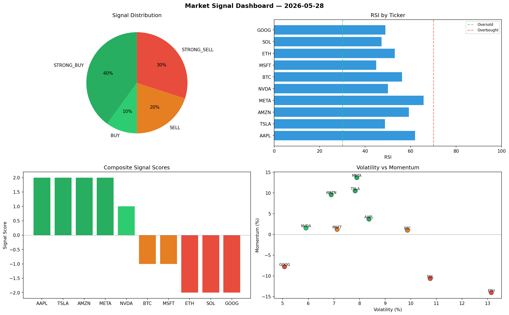

# Market Signal Report — 2026-05-28

**Run ID:** `14f14778dd` | **Buy:** 5 | **Sell:** 5 | **Hold:** 0

## Signal Dashboard

| Ticker | Price | Signal | Score | RSI | Momentum | Confidence |
|--------|-------|--------|-------|-----|----------|------------|
| AAPL | $2647.7 | **STRONG_BUY** | 2 | 61.96 | 0.0369 | 0.5 |
| TSLA | $382.45 | **STRONG_BUY** | 2 | 48.67 | 0.105 | 0.5 |
| AMZN | $3831.26 | **STRONG_BUY** | 2 | 59.22 | 0.0957 | 0.5 |
| META | $2648.28 | **STRONG_BUY** | 2 | 65.68 | 0.137 | 0.5 |
| NVDA | $4062.03 | **BUY** | 1 | 50.05 | 0.0154 | 0.25 |
| BTC | $2836.39 | **SELL** | -1 | 56.25 | 0.0101 | 0.25 |
| MSFT | $4751.09 | **SELL** | -1 | 44.85 | 0.0122 | 0.25 |
| ETH | $851.31 | **STRONG_SELL** | -2 | 53.05 | -0.1404 | 0.5 |
| SOL | $882.8 | **STRONG_SELL** | -2 | 47.24 | -0.1065 | 0.5 |
| GOOG | $1221.52 | **STRONG_SELL** | -2 | 48.93 | -0.0779 | 0.5 |

## Delta vs Yesterday

| Ticker | Today | Yesterday | Price Change | Signal Changed |
|--------|-------|-----------|-------------|----------------|
| AAPL | STRONG_BUY | STRONG_SELL | 📈 75.08% | ⚠️ YES |
| TSLA | STRONG_BUY | HOLD | 📉 -70.45% | ⚠️ YES |
| AMZN | STRONG_BUY | HOLD | 📈 3279.43% | ⚠️ YES |
| META | STRONG_BUY | STRONG_BUY | 📉 -52.27% | — |
| NVDA | BUY | STRONG_BUY | 📈 1911.9% | ⚠️ YES |
| BTC | SELL | HOLD | 📉 -40.92% | ⚠️ YES |
| MSFT | SELL | STRONG_BUY | 📈 186.01% | ⚠️ YES |
| ETH | STRONG_SELL | BUY | 📈 257.17% | ⚠️ YES |
| SOL | STRONG_SELL | STRONG_SELL | 📉 -80.56% | — |
| GOOG | STRONG_SELL | STRONG_BUY | 📈 71.24% | ⚠️ YES |