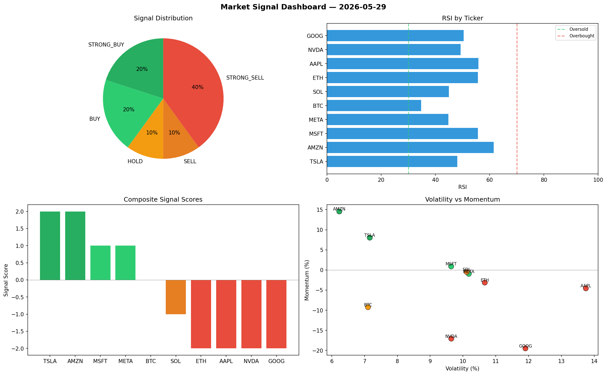

# Market Signal Report — 2026-05-29

**Run ID:** `4c448d0142` | **Buy:** 4 | **Sell:** 5 | **Hold:** 1

## Signal Dashboard

| Ticker | Price | Signal | Score | RSI | Momentum | Confidence |
|--------|-------|--------|-------|-----|----------|------------|
| TSLA | $1577.76 | **STRONG_BUY** | 2 | 48.04 | 0.0803 | 0.5 |
| AMZN | $1549.02 | **STRONG_BUY** | 2 | 61.43 | 0.1454 | 0.5 |
| MSFT | $3528.36 | **BUY** | 1 | 55.61 | 0.0089 | 0.25 |
| META | $2500.37 | **BUY** | 1 | 44.79 | -0.0096 | 0.25 |
| BTC | $4881.25 | **HOLD** | 0 | 34.74 | -0.0924 | 0.0 |
| SOL | $4411.43 | **SELL** | -1 | 44.91 | -0.005 | 0.25 |
| ETH | $1416.33 | **STRONG_SELL** | -2 | 55.62 | -0.0314 | 0.5 |
| AAPL | $4483.11 | **STRONG_SELL** | -2 | 55.87 | -0.0456 | 0.5 |
| NVDA | $3652.56 | **STRONG_SELL** | -2 | 49.23 | -0.1707 | 0.5 |
| GOOG | $1704.53 | **STRONG_SELL** | -2 | 50.38 | -0.1948 | 0.5 |

## Delta vs Yesterday

| Ticker | Today | Yesterday | Price Change | Signal Changed |
|--------|-------|-----------|-------------|----------------|
| TSLA | STRONG_BUY | HOLD | 📉 -41.67% | ⚠️ YES |
| AMZN | STRONG_BUY | STRONG_BUY | 📉 -56.85% | — |
| MSFT | BUY | STRONG_BUY | 📈 24.47% | ⚠️ YES |
| META | BUY | HOLD | 📉 -16.79% | ⚠️ YES |
| BTC | HOLD | STRONG_BUY | 📈 43.48% | ⚠️ YES |
| SOL | SELL | BUY | 📈 49.5% | ⚠️ YES |
| ETH | STRONG_SELL | SELL | 📉 -65.07% | ⚠️ YES |
| AAPL | STRONG_SELL | STRONG_SELL | 📈 20.95% | — |
| NVDA | STRONG_SELL | HOLD | 📉 -19.36% | ⚠️ YES |
| GOOG | STRONG_SELL | STRONG_BUY | 📉 -60.36% | ⚠️ YES |