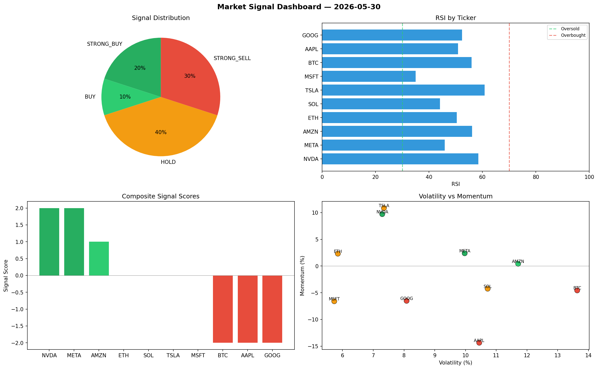

# Market Signal Report — 2026-05-30

**Run ID:** `609e8395cc` | **Buy:** 3 | **Sell:** 3 | **Hold:** 4

## Signal Dashboard

| Ticker | Price | Signal | Score | RSI | Momentum | Confidence |
|--------|-------|--------|-------|-----|----------|------------|
| NVDA | $5425.87 | **STRONG_BUY** | 2 | 58.5 | 0.0971 | 0.5 |
| META | $765.47 | **STRONG_BUY** | 2 | 45.87 | 0.0238 | 0.5 |
| AMZN | $33.23 | **BUY** | 1 | 56.14 | 0.0042 | 0.25 |
| ETH | $3283.54 | **HOLD** | 0 | 50.37 | 0.0231 | 0.0 |
| SOL | $2820.13 | **HOLD** | 0 | 44.15 | -0.0425 | 0.0 |
| TSLA | $3521.27 | **HOLD** | 0 | 60.81 | 0.1085 | 0.0 |
| MSFT | $159.3 | **HOLD** | 0 | 34.98 | -0.066 | 0.0 |
| BTC | $3534.44 | **STRONG_SELL** | -2 | 55.97 | -0.0457 | 0.5 |
| AAPL | $3706.89 | **STRONG_SELL** | -2 | 50.91 | -0.1437 | 0.5 |
| GOOG | $241.7 | **STRONG_SELL** | -2 | 52.37 | -0.0652 | 0.5 |

## Delta vs Yesterday

| Ticker | Today | Yesterday | Price Change | Signal Changed |
|--------|-------|-----------|-------------|----------------|
| NVDA | STRONG_BUY | HOLD | 📈 5340.56% | ⚠️ YES |
| META | STRONG_BUY | BUY | 📉 -64.72% | ⚠️ YES |
| AMZN | BUY | HOLD | 📉 -95.91% | ⚠️ YES |
| ETH | HOLD | HOLD | 📉 -28.33% | — |
| SOL | HOLD | STRONG_BUY | 📈 102.17% | ⚠️ YES |
| TSLA | HOLD | BUY | 📈 236.8% | ⚠️ YES |
| MSFT | HOLD | HOLD | 📉 -96.41% | — |
| BTC | STRONG_SELL | STRONG_BUY | 📈 1190.93% | ⚠️ YES |
| AAPL | STRONG_SELL | STRONG_BUY | 📈 4.66% | ⚠️ YES |
| GOOG | STRONG_SELL | STRONG_SELL | 📉 -93.63% | — |