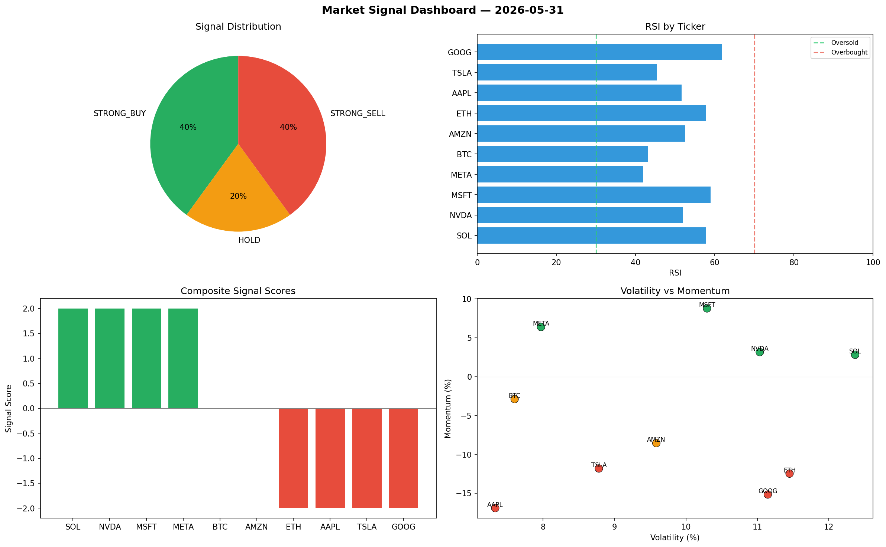

# Market Signal Report — 2026-05-31

**Run ID:** `00b2ddc9ed` | **Buy:** 4 | **Sell:** 4 | **Hold:** 2

## Signal Dashboard

| Ticker | Price | Signal | Score | RSI | Momentum | Confidence |
|--------|-------|--------|-------|-----|----------|------------|
| SOL | $4107.29 | **STRONG_BUY** | 2 | 57.73 | 0.0281 | 0.5 |
| NVDA | $4864.78 | **STRONG_BUY** | 2 | 51.9 | 0.0315 | 0.5 |
| MSFT | $4326.11 | **STRONG_BUY** | 2 | 58.95 | 0.0877 | 0.5 |
| META | $2443.5 | **STRONG_BUY** | 2 | 41.82 | 0.0638 | 0.5 |
| BTC | $1623.41 | **HOLD** | 0 | 43.18 | -0.0289 | 0.0 |
| AMZN | $1313.38 | **HOLD** | 0 | 52.57 | -0.0856 | 0.0 |
| ETH | $4355.15 | **STRONG_SELL** | -2 | 57.82 | -0.1248 | 0.5 |
| AAPL | $2088.69 | **STRONG_SELL** | -2 | 51.61 | -0.1692 | 0.5 |
| TSLA | $4625.36 | **STRONG_SELL** | -2 | 45.36 | -0.1182 | 0.5 |
| GOOG | $2012.08 | **STRONG_SELL** | -2 | 61.75 | -0.1517 | 0.5 |

## Delta vs Yesterday

| Ticker | Today | Yesterday | Price Change | Signal Changed |
|--------|-------|-----------|-------------|----------------|
| SOL | STRONG_BUY | SELL | 📈 21.24% | ⚠️ YES |
| NVDA | STRONG_BUY | HOLD | 📈 132.97% | ⚠️ YES |
| MSFT | STRONG_BUY | STRONG_SELL | 📈 29.92% | ⚠️ YES |
| META | STRONG_BUY | STRONG_BUY | 📈 1799.19% | — |
| BTC | HOLD | BUY | 📉 -62.15% | ⚠️ YES |
| AMZN | HOLD | HOLD | 📉 -64.78% | — |
| ETH | STRONG_SELL | STRONG_BUY | 📉 -4.99% | ⚠️ YES |
| AAPL | STRONG_SELL | SELL | 📉 -59.24% | ⚠️ YES |
| TSLA | STRONG_SELL | HOLD | 📈 70.28% | ⚠️ YES |
| GOOG | STRONG_SELL | BUY | 📈 196.4% | ⚠️ YES |