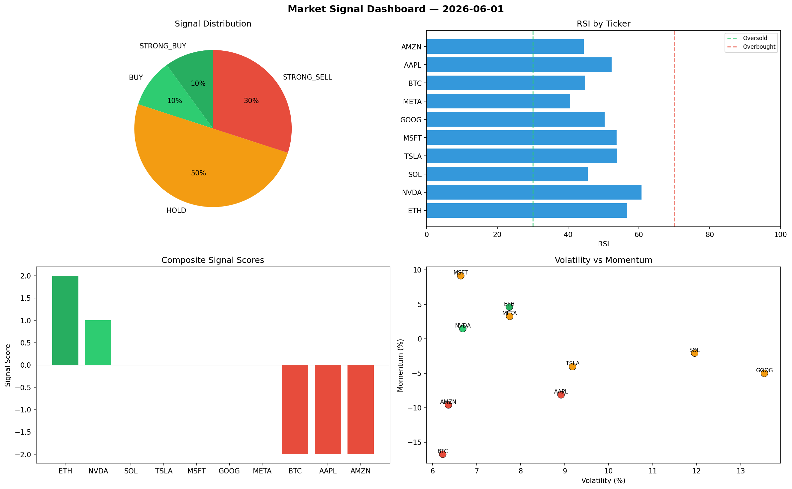

# Market Signal Report — 2026-06-01

**Run ID:** `3935b2a12d` | **Buy:** 2 | **Sell:** 3 | **Hold:** 5

## Signal Dashboard

| Ticker | Price | Signal | Score | RSI | Momentum | Confidence |
|--------|-------|--------|-------|-----|----------|------------|
| ETH | $221.55 | **STRONG_BUY** | 2 | 56.72 | 0.0459 | 0.5 |
| NVDA | $747.57 | **BUY** | 1 | 60.75 | 0.0146 | 0.25 |
| SOL | $4489.9 | **HOLD** | 0 | 45.55 | -0.0209 | 0.0 |
| TSLA | $2438.22 | **HOLD** | 0 | 53.83 | -0.0405 | 0.0 |
| MSFT | $3363.01 | **HOLD** | 0 | 53.69 | 0.0913 | 0.0 |
| GOOG | $4887.76 | **HOLD** | 0 | 50.35 | -0.0503 | 0.0 |
| META | $2058.96 | **HOLD** | 0 | 40.52 | 0.0324 | 0.0 |
| BTC | $3434.49 | **STRONG_SELL** | -2 | 44.73 | -0.1676 | 0.5 |
| AAPL | $2788.89 | **STRONG_SELL** | -2 | 52.26 | -0.0814 | 0.5 |
| AMZN | $452.31 | **STRONG_SELL** | -2 | 44.36 | -0.0961 | 0.5 |

## Delta vs Yesterday

| Ticker | Today | Yesterday | Price Change | Signal Changed |
|--------|-------|-----------|-------------|----------------|
| ETH | STRONG_BUY | HOLD | 📈 79.04% | ⚠️ YES |
| NVDA | BUY | BUY | 📉 -58.69% | — |
| SOL | HOLD | HOLD | 📈 120.67% | — |
| TSLA | HOLD | STRONG_SELL | 📉 -26.05% | ⚠️ YES |
| MSFT | HOLD | STRONG_BUY | 📈 10.66% | ⚠️ YES |
| GOOG | HOLD | STRONG_SELL | 📈 51.02% | ⚠️ YES |
| META | HOLD | STRONG_SELL | 📉 -40.45% | ⚠️ YES |
| BTC | STRONG_SELL | STRONG_SELL | 📈 23.39% | — |
| AAPL | STRONG_SELL | STRONG_SELL | 📈 399.2% | — |
| AMZN | STRONG_SELL | STRONG_SELL | 📉 -88.54% | — |