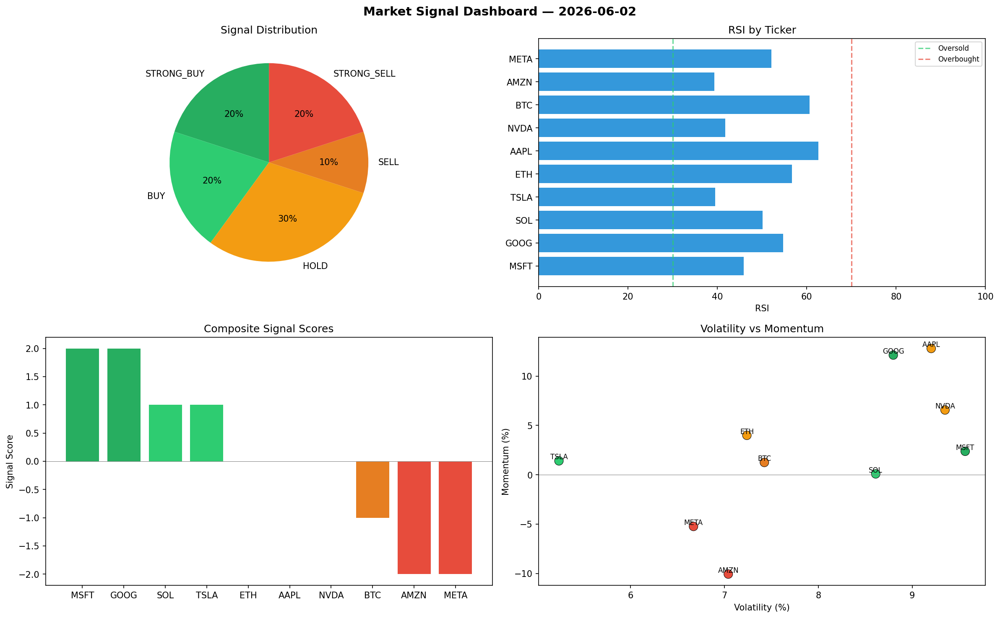

# Market Signal Report — 2026-06-02

**Run ID:** `3cf9798df2` | **Buy:** 4 | **Sell:** 3 | **Hold:** 3

## Signal Dashboard

| Ticker | Price | Signal | Score | RSI | Momentum | Confidence |
|--------|-------|--------|-------|-----|----------|------------|
| MSFT | $1375.23 | **STRONG_BUY** | 2 | 45.9 | 0.0238 | 0.5 |
| GOOG | $1690.45 | **STRONG_BUY** | 2 | 54.69 | 0.1214 | 0.5 |
| SOL | $2033.65 | **BUY** | 1 | 50.15 | 0.0009 | 0.25 |
| TSLA | $2987.47 | **BUY** | 1 | 39.52 | 0.0141 | 0.25 |
| ETH | $4431.68 | **HOLD** | 0 | 56.67 | 0.04 | 0.0 |
| AAPL | $33.73 | **HOLD** | 0 | 62.6 | 0.1281 | 0.0 |
| NVDA | $4733.48 | **HOLD** | 0 | 41.77 | 0.0657 | 0.0 |
| BTC | $553.4 | **SELL** | -1 | 60.6 | 0.0125 | 0.25 |
| AMZN | $2203.47 | **STRONG_SELL** | -2 | 39.36 | -0.1007 | 0.5 |
| META | $1287.82 | **STRONG_SELL** | -2 | 52.1 | -0.0524 | 0.5 |

## Delta vs Yesterday

| Ticker | Today | Yesterday | Price Change | Signal Changed |
|--------|-------|-----------|-------------|----------------|
| MSFT | STRONG_BUY | STRONG_BUY | 📈 2.04% | — |
| GOOG | STRONG_BUY | STRONG_SELL | 📈 24.53% | ⚠️ YES |
| SOL | BUY | STRONG_SELL | 📉 -14.53% | ⚠️ YES |
| TSLA | BUY | STRONG_BUY | 📈 2.44% | ⚠️ YES |
| ETH | HOLD | STRONG_SELL | 📈 118.51% | ⚠️ YES |
| AAPL | HOLD | STRONG_BUY | 📉 -98.94% | ⚠️ YES |
| NVDA | HOLD | HOLD | 📈 138.97% | — |
| BTC | SELL | STRONG_SELL | 📉 -68.14% | ⚠️ YES |
| AMZN | STRONG_SELL | HOLD | 📉 -48.94% | ⚠️ YES |
| META | STRONG_SELL | STRONG_BUY | 📉 -22.5% | ⚠️ YES |