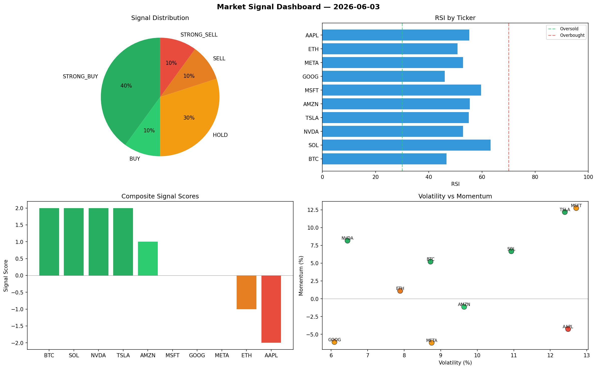

# Market Signal Report — 2026-06-03

**Run ID:** `ec4b660c49` | **Buy:** 5 | **Sell:** 2 | **Hold:** 3

## Signal Dashboard

| Ticker | Price | Signal | Score | RSI | Momentum | Confidence |
|--------|-------|--------|-------|-----|----------|------------|
| BTC | $3295.15 | **STRONG_BUY** | 2 | 46.63 | 0.0521 | 0.5 |
| SOL | $2440.3 | **STRONG_BUY** | 2 | 63.26 | 0.0667 | 0.5 |
| NVDA | $1908.41 | **STRONG_BUY** | 2 | 52.85 | 0.0816 | 0.5 |
| TSLA | $877.83 | **STRONG_BUY** | 2 | 55.01 | 0.1218 | 0.5 |
| AMZN | $3623.37 | **BUY** | 1 | 55.42 | -0.0114 | 0.25 |
| MSFT | $2288.2 | **HOLD** | 0 | 59.67 | 0.1274 | 0.0 |
| GOOG | $1621.27 | **HOLD** | 0 | 46.0 | -0.0608 | 0.0 |
| META | $3201.37 | **HOLD** | 0 | 52.87 | -0.0619 | 0.0 |
| ETH | $2143.2 | **SELL** | -1 | 50.79 | 0.0111 | 0.25 |
| AAPL | $4110.68 | **STRONG_SELL** | -2 | 55.26 | -0.0426 | 0.5 |

## Delta vs Yesterday

| Ticker | Today | Yesterday | Price Change | Signal Changed |
|--------|-------|-----------|-------------|----------------|
| BTC | STRONG_BUY | BUY | 📈 186.29% | ⚠️ YES |
| SOL | STRONG_BUY | SELL | 📉 -20.38% | ⚠️ YES |
| NVDA | STRONG_BUY | STRONG_SELL | 📉 -10.11% | ⚠️ YES |
| TSLA | STRONG_BUY | SELL | 📉 -77.17% | ⚠️ YES |
| AMZN | BUY | STRONG_BUY | 📈 498.49% | ⚠️ YES |
| MSFT | HOLD | HOLD | 📉 -49.02% | — |
| GOOG | HOLD | STRONG_SELL | 📉 -58.29% | ⚠️ YES |
| META | HOLD | STRONG_SELL | 📈 57.86% | ⚠️ YES |
| ETH | SELL | STRONG_BUY | 📈 494.16% | ⚠️ YES |
| AAPL | STRONG_SELL | HOLD | 📈 10.89% | ⚠️ YES |