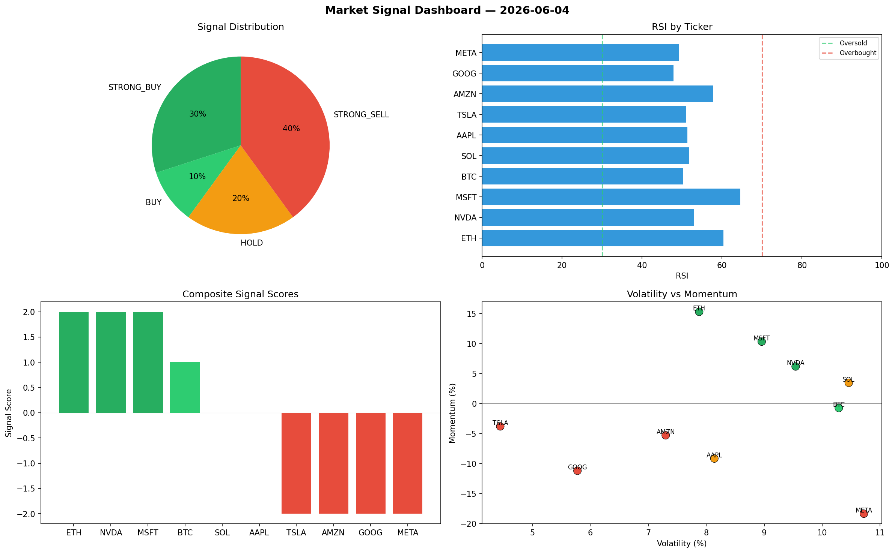

# Market Signal Report — 2026-06-04

**Run ID:** `c486709248` | **Buy:** 4 | **Sell:** 4 | **Hold:** 2

## Signal Dashboard

| Ticker | Price | Signal | Score | RSI | Momentum | Confidence |
|--------|-------|--------|-------|-----|----------|------------|
| ETH | $135.38 | **STRONG_BUY** | 2 | 60.32 | 0.153 | 0.5 |
| NVDA | $3838.51 | **STRONG_BUY** | 2 | 52.99 | 0.0618 | 0.5 |
| MSFT | $239.22 | **STRONG_BUY** | 2 | 64.54 | 0.1033 | 0.5 |
| BTC | $931.84 | **BUY** | 1 | 50.32 | -0.0074 | 0.25 |
| SOL | $2026.33 | **HOLD** | 0 | 51.84 | 0.0346 | 0.0 |
| AAPL | $1231.07 | **HOLD** | 0 | 51.32 | -0.0917 | 0.0 |
| TSLA | $1863.15 | **STRONG_SELL** | -2 | 51.08 | -0.0381 | 0.5 |
| AMZN | $3637.2 | **STRONG_SELL** | -2 | 57.7 | -0.053 | 0.5 |
| GOOG | $748.54 | **STRONG_SELL** | -2 | 47.87 | -0.1121 | 0.5 |
| META | $4275.51 | **STRONG_SELL** | -2 | 49.18 | -0.1837 | 0.5 |

## Delta vs Yesterday

| Ticker | Today | Yesterday | Price Change | Signal Changed |
|--------|-------|-----------|-------------|----------------|
| ETH | STRONG_BUY | SELL | 📉 -93.68% | ⚠️ YES |
| NVDA | STRONG_BUY | STRONG_BUY | 📈 101.14% | — |
| MSFT | STRONG_BUY | HOLD | 📉 -89.55% | ⚠️ YES |
| BTC | BUY | STRONG_BUY | 📉 -71.72% | ⚠️ YES |
| SOL | HOLD | STRONG_BUY | 📉 -16.96% | ⚠️ YES |
| AAPL | HOLD | STRONG_SELL | 📉 -70.05% | ⚠️ YES |
| TSLA | STRONG_SELL | STRONG_BUY | 📈 112.24% | ⚠️ YES |
| AMZN | STRONG_SELL | BUY | 📈 0.38% | ⚠️ YES |
| GOOG | STRONG_SELL | HOLD | 📉 -53.83% | ⚠️ YES |
| META | STRONG_SELL | HOLD | 📈 33.55% | ⚠️ YES |