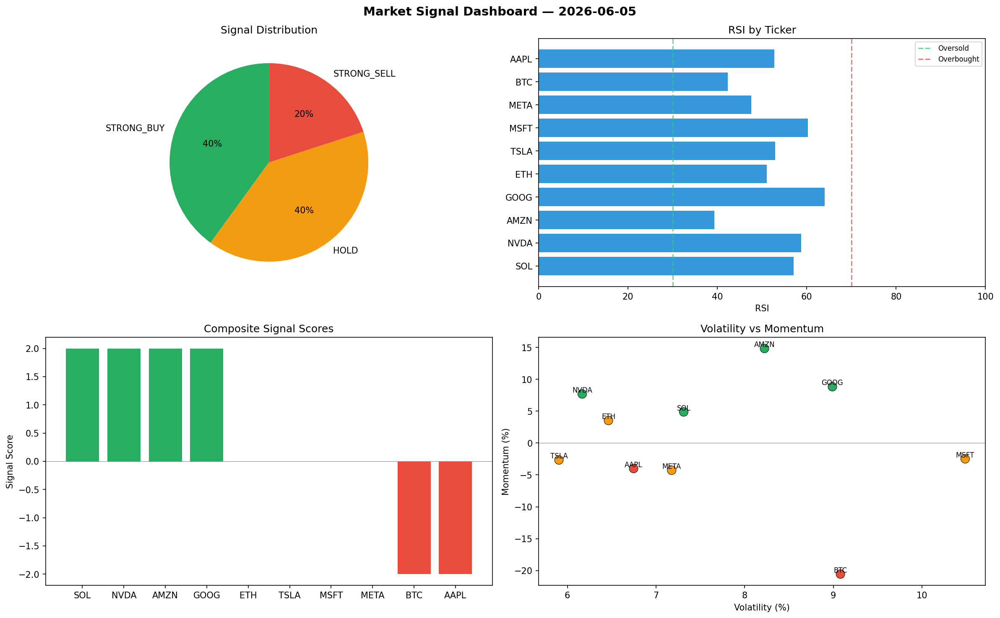

# Market Signal Report — 2026-06-05

**Run ID:** `4ff00c420c` | **Buy:** 4 | **Sell:** 2 | **Hold:** 4

## Signal Dashboard

| Ticker | Price | Signal | Score | RSI | Momentum | Confidence |
|--------|-------|--------|-------|-----|----------|------------|
| SOL | $124.79 | **STRONG_BUY** | 2 | 57.02 | 0.0488 | 0.5 |
| NVDA | $5057.94 | **STRONG_BUY** | 2 | 58.72 | 0.077 | 0.5 |
| AMZN | $4324.77 | **STRONG_BUY** | 2 | 39.29 | 0.1484 | 0.5 |
| GOOG | $2316.06 | **STRONG_BUY** | 2 | 63.97 | 0.0884 | 0.5 |
| ETH | $5205.01 | **HOLD** | 0 | 51.05 | 0.0354 | 0.0 |
| TSLA | $3871.14 | **HOLD** | 0 | 52.97 | -0.0266 | 0.0 |
| MSFT | $2515.78 | **HOLD** | 0 | 60.23 | -0.0248 | 0.0 |
| META | $4035.29 | **HOLD** | 0 | 47.62 | -0.0427 | 0.0 |
| BTC | $2357.27 | **STRONG_SELL** | -2 | 42.34 | -0.2056 | 0.5 |
| AAPL | $4064.3 | **STRONG_SELL** | -2 | 52.75 | -0.04 | 0.5 |

## Delta vs Yesterday

| Ticker | Today | Yesterday | Price Change | Signal Changed |
|--------|-------|-----------|-------------|----------------|
| SOL | STRONG_BUY | STRONG_SELL | 📉 -95.53% | ⚠️ YES |
| NVDA | STRONG_BUY | STRONG_BUY | 📈 153.09% | — |
| AMZN | STRONG_BUY | SELL | 📈 28.75% | ⚠️ YES |
| GOOG | STRONG_BUY | SELL | 📈 52.93% | ⚠️ YES |
| ETH | HOLD | STRONG_SELL | 📈 9405.13% | ⚠️ YES |
| TSLA | HOLD | HOLD | 📈 65.72% | — |
| MSFT | HOLD | STRONG_BUY | 📈 597.53% | ⚠️ YES |
| META | HOLD | STRONG_SELL | 📉 -15.99% | ⚠️ YES |
| BTC | STRONG_SELL | HOLD | 📉 -46.68% | ⚠️ YES |
| AAPL | STRONG_SELL | HOLD | 📈 18.44% | ⚠️ YES |