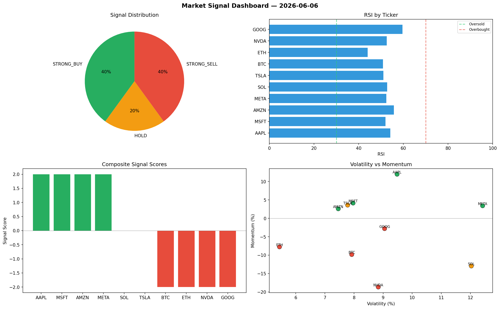

# Market Signal Report — 2026-06-06

**Run ID:** `d79f24c961` | **Buy:** 4 | **Sell:** 4 | **Hold:** 2

## Signal Dashboard

| Ticker | Price | Signal | Score | RSI | Momentum | Confidence |
|--------|-------|--------|-------|-----|----------|------------|
| AAPL | $2936.54 | **STRONG_BUY** | 2 | 54.11 | 0.1196 | 0.5 |
| MSFT | $4258.17 | **STRONG_BUY** | 2 | 52.0 | 0.0413 | 0.5 |
| AMZN | $3086.27 | **STRONG_BUY** | 2 | 55.71 | 0.0258 | 0.5 |
| META | $4802.38 | **STRONG_BUY** | 2 | 52.34 | 0.034 | 0.5 |
| SOL | $857.87 | **HOLD** | 0 | 52.73 | -0.1294 | 0.0 |
| TSLA | $4214.07 | **HOLD** | 0 | 51.01 | 0.0358 | 0.0 |
| BTC | $591.17 | **STRONG_SELL** | -2 | 50.87 | -0.0983 | 0.5 |
| ETH | $2628.71 | **STRONG_SELL** | -2 | 44.02 | -0.0775 | 0.5 |
| NVDA | $2640.18 | **STRONG_SELL** | -2 | 52.51 | -0.1865 | 0.5 |
| GOOG | $2541.15 | **STRONG_SELL** | -2 | 59.6 | -0.028 | 0.5 |

## Delta vs Yesterday

| Ticker | Today | Yesterday | Price Change | Signal Changed |
|--------|-------|-----------|-------------|----------------|
| AAPL | STRONG_BUY | STRONG_SELL | 📈 92.52% | ⚠️ YES |
| MSFT | STRONG_BUY | BUY | 📈 83.49% | ⚠️ YES |
| AMZN | STRONG_BUY | STRONG_BUY | 📉 -25.17% | — |
| META | STRONG_BUY | STRONG_SELL | 📈 65.77% | ⚠️ YES |
| SOL | HOLD | STRONG_SELL | 📉 -68.93% | ⚠️ YES |
| TSLA | HOLD | HOLD | 📉 -3.32% | — |
| BTC | STRONG_SELL | BUY | 📈 10.57% | ⚠️ YES |
| ETH | STRONG_SELL | STRONG_BUY | 📉 -24.3% | ⚠️ YES |
| NVDA | STRONG_SELL | HOLD | 📉 -36.87% | ⚠️ YES |
| GOOG | STRONG_SELL | HOLD | 📉 -47.86% | ⚠️ YES |