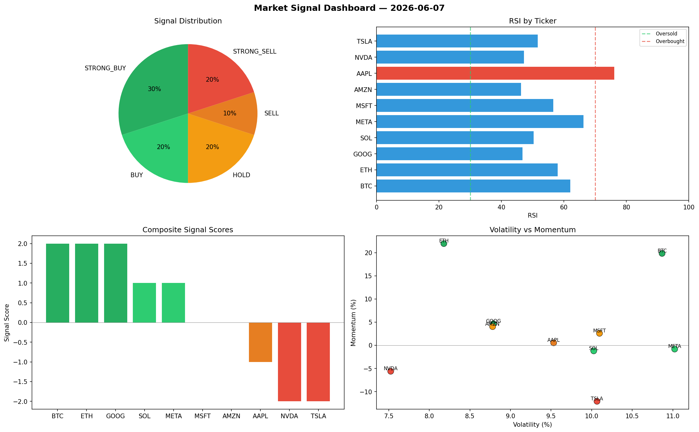

# Market Signal Report — 2026-06-07

**Run ID:** `4bff7e737a` | **Buy:** 5 | **Sell:** 3 | **Hold:** 2

## Signal Dashboard

| Ticker | Price | Signal | Score | RSI | Momentum | Confidence |
|--------|-------|--------|-------|-----|----------|------------|
| BTC | $4651.98 | **STRONG_BUY** | 2 | 62.02 | 0.1983 | 0.5 |
| ETH | $4200.28 | **STRONG_BUY** | 2 | 58.0 | 0.2195 | 0.5 |
| GOOG | $2374.26 | **STRONG_BUY** | 2 | 46.75 | 0.0465 | 0.5 |
| SOL | $2939.82 | **BUY** | 1 | 50.3 | -0.0121 | 0.25 |
| META | $4363.06 | **BUY** | 1 | 66.23 | -0.0082 | 0.25 |
| MSFT | $2748.62 | **HOLD** | 0 | 56.61 | 0.0258 | 0.0 |
| AMZN | $3675.2 | **HOLD** | 0 | 46.27 | 0.0403 | 0.0 |
| AAPL | $2971.87 | **SELL** | -1 | 76.16 | 0.0053 | 0.25 |
| NVDA | $387.84 | **STRONG_SELL** | -2 | 47.24 | -0.0561 | 0.5 |
| TSLA | $3744.2 | **STRONG_SELL** | -2 | 51.62 | -0.1209 | 0.5 |

## Delta vs Yesterday

| Ticker | Today | Yesterday | Price Change | Signal Changed |
|--------|-------|-----------|-------------|----------------|
| BTC | STRONG_BUY | STRONG_SELL | 📈 3.46% | ⚠️ YES |
| ETH | STRONG_BUY | HOLD | 📉 -3.26% | ⚠️ YES |
| GOOG | STRONG_BUY | STRONG_SELL | 📉 -45.01% | ⚠️ YES |
| SOL | BUY | STRONG_SELL | 📈 436.46% | ⚠️ YES |
| META | BUY | HOLD | 📈 277.34% | ⚠️ YES |
| MSFT | HOLD | SELL | 📈 168.17% | ⚠️ YES |
| AMZN | HOLD | BUY | 📈 370.53% | ⚠️ YES |
| AAPL | SELL | STRONG_BUY | 📈 59.74% | ⚠️ YES |
| NVDA | STRONG_SELL | STRONG_SELL | 📉 -79.97% | — |
| TSLA | STRONG_SELL | SELL | 📈 36.09% | ⚠️ YES |