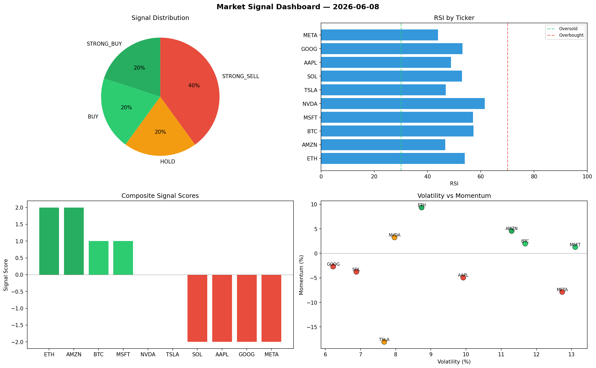

# Market Signal Report — 2026-06-08

**Run ID:** `8be0a1b096` | **Buy:** 4 | **Sell:** 4 | **Hold:** 2

## Signal Dashboard

| Ticker | Price | Signal | Score | RSI | Momentum | Confidence |
|--------|-------|--------|-------|-----|----------|------------|
| ETH | $2052.86 | **STRONG_BUY** | 2 | 53.98 | 0.0934 | 0.5 |
| AMZN | $2294.71 | **STRONG_BUY** | 2 | 46.67 | 0.0456 | 0.5 |
| BTC | $2646.81 | **BUY** | 1 | 57.23 | 0.0198 | 0.25 |
| MSFT | $2307.77 | **BUY** | 1 | 57.08 | 0.0128 | 0.25 |
| NVDA | $3215.75 | **HOLD** | 0 | 61.47 | 0.0325 | 0.0 |
| TSLA | $3264.52 | **HOLD** | 0 | 46.83 | -0.1804 | 0.0 |
| SOL | $834.23 | **STRONG_SELL** | -2 | 52.95 | -0.0376 | 0.5 |
| AAPL | $623.42 | **STRONG_SELL** | -2 | 48.77 | -0.0495 | 0.5 |
| GOOG | $4824.31 | **STRONG_SELL** | -2 | 53.11 | -0.0269 | 0.5 |
| META | $3717.61 | **STRONG_SELL** | -2 | 43.9 | -0.0787 | 0.5 |

## Delta vs Yesterday

| Ticker | Today | Yesterday | Price Change | Signal Changed |
|--------|-------|-----------|-------------|----------------|
| ETH | STRONG_BUY | STRONG_BUY | 📉 -51.13% | — |
| AMZN | STRONG_BUY | HOLD | 📉 -37.56% | ⚠️ YES |
| BTC | BUY | STRONG_BUY | 📉 -43.1% | ⚠️ YES |
| MSFT | BUY | HOLD | 📉 -16.04% | ⚠️ YES |
| NVDA | HOLD | STRONG_SELL | 📈 729.14% | ⚠️ YES |
| TSLA | HOLD | STRONG_SELL | 📉 -12.81% | ⚠️ YES |
| SOL | STRONG_SELL | BUY | 📉 -71.62% | ⚠️ YES |
| AAPL | STRONG_SELL | SELL | 📉 -79.02% | ⚠️ YES |
| GOOG | STRONG_SELL | STRONG_BUY | 📈 103.19% | ⚠️ YES |
| META | STRONG_SELL | BUY | 📉 -14.79% | ⚠️ YES |