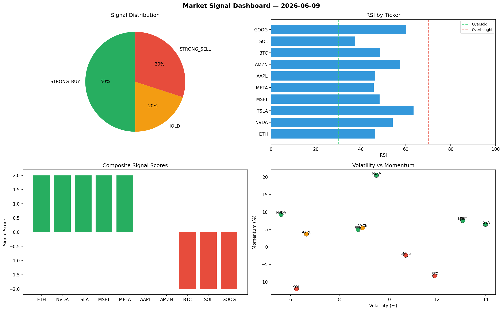

# Market Signal Report — 2026-06-09

**Run ID:** `f3ef057933` | **Buy:** 5 | **Sell:** 3 | **Hold:** 2

## Signal Dashboard

| Ticker | Price | Signal | Score | RSI | Momentum | Confidence |
|--------|-------|--------|-------|-----|----------|------------|
| ETH | $1821.36 | **STRONG_BUY** | 2 | 46.46 | 0.0493 | 0.5 |
| NVDA | $1575.14 | **STRONG_BUY** | 2 | 54.13 | 0.0925 | 0.5 |
| TSLA | $574.77 | **STRONG_BUY** | 2 | 63.46 | 0.0642 | 0.5 |
| MSFT | $2167.32 | **STRONG_BUY** | 2 | 48.35 | 0.0751 | 0.5 |
| META | $4685.88 | **STRONG_BUY** | 2 | 45.69 | 0.2046 | 0.5 |
| AAPL | $3844.87 | **HOLD** | 0 | 46.23 | 0.0364 | 0.0 |
| AMZN | $1871.21 | **HOLD** | 0 | 57.56 | 0.0544 | 0.0 |
| BTC | $1857.21 | **STRONG_SELL** | -2 | 48.61 | -0.0827 | 0.5 |
| SOL | $2151.77 | **STRONG_SELL** | -2 | 37.44 | -0.1202 | 0.5 |
| GOOG | $507.79 | **STRONG_SELL** | -2 | 60.29 | -0.0241 | 0.5 |

## Delta vs Yesterday

| Ticker | Today | Yesterday | Price Change | Signal Changed |
|--------|-------|-----------|-------------|----------------|
| ETH | STRONG_BUY | STRONG_BUY | 📉 -11.28% | — |
| NVDA | STRONG_BUY | HOLD | 📉 -51.02% | ⚠️ YES |
| TSLA | STRONG_BUY | HOLD | 📉 -82.39% | ⚠️ YES |
| MSFT | STRONG_BUY | BUY | 📉 -6.09% | ⚠️ YES |
| META | STRONG_BUY | STRONG_SELL | 📈 26.05% | ⚠️ YES |
| AAPL | HOLD | STRONG_SELL | 📈 516.74% | ⚠️ YES |
| AMZN | HOLD | STRONG_BUY | 📉 -18.46% | ⚠️ YES |
| BTC | STRONG_SELL | BUY | 📉 -29.83% | ⚠️ YES |
| SOL | STRONG_SELL | STRONG_SELL | 📈 157.93% | — |
| GOOG | STRONG_SELL | STRONG_SELL | 📉 -89.47% | — |