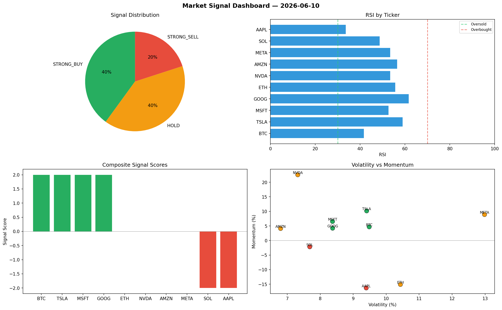

# Market Signal Report — 2026-06-10

**Run ID:** `bd25f7237d` | **Buy:** 4 | **Sell:** 2 | **Hold:** 4

## Signal Dashboard

| Ticker | Price | Signal | Score | RSI | Momentum | Confidence |
|--------|-------|--------|-------|-----|----------|------------|
| BTC | $4770.61 | **STRONG_BUY** | 2 | 41.69 | 0.0468 | 0.5 |
| TSLA | $1221.76 | **STRONG_BUY** | 2 | 58.98 | 0.1016 | 0.5 |
| MSFT | $2576.36 | **STRONG_BUY** | 2 | 52.64 | 0.0653 | 0.5 |
| GOOG | $3488.85 | **STRONG_BUY** | 2 | 61.7 | 0.0422 | 0.5 |
| ETH | $4090.73 | **HOLD** | 0 | 55.65 | -0.1509 | 0.0 |
| NVDA | $4244.24 | **HOLD** | 0 | 53.4 | 0.2256 | 0.0 |
| AMZN | $891.6 | **HOLD** | 0 | 56.53 | 0.0412 | 0.0 |
| META | $4680.37 | **HOLD** | 0 | 53.41 | 0.0891 | 0.0 |
| SOL | $721.0 | **STRONG_SELL** | -2 | 48.75 | -0.0217 | 0.5 |
| AAPL | $1886.17 | **STRONG_SELL** | -2 | 33.64 | -0.1629 | 0.5 |

## Delta vs Yesterday

| Ticker | Today | Yesterday | Price Change | Signal Changed |
|--------|-------|-----------|-------------|----------------|
| BTC | STRONG_BUY | STRONG_BUY | 📈 3.65% | — |
| TSLA | STRONG_BUY | HOLD | 📈 89.53% | ⚠️ YES |
| MSFT | STRONG_BUY | STRONG_BUY | 📉 -32.46% | — |
| GOOG | STRONG_BUY | STRONG_SELL | 📉 -18.38% | ⚠️ YES |
| ETH | HOLD | STRONG_SELL | 📈 1379.63% | ⚠️ YES |
| NVDA | HOLD | STRONG_SELL | 📈 28500.0% | ⚠️ YES |
| AMZN | HOLD | BUY | 📉 -48.34% | ⚠️ YES |
| META | HOLD | BUY | 📈 127.03% | ⚠️ YES |
| SOL | STRONG_SELL | STRONG_SELL | 📉 -74.14% | — |
| AAPL | STRONG_SELL | BUY | 📉 -50.4% | ⚠️ YES |