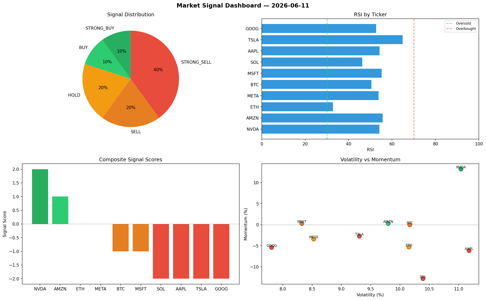

# Market Signal Report — 2026-06-11

**Run ID:** `153d342897` | **Buy:** 2 | **Sell:** 6 | **Hold:** 2

## Signal Dashboard

| Ticker | Price | Signal | Score | RSI | Momentum | Confidence |
|--------|-------|--------|-------|-----|----------|------------|
| NVDA | $4557.3 | **STRONG_BUY** | 2 | 54.19 | 0.132 | 0.5 |
| AMZN | $3741.72 | **BUY** | 1 | 55.64 | 0.0026 | 0.25 |
| ETH | $2651.67 | **HOLD** | 0 | 32.79 | -0.0534 | 0.0 |
| META | $4311.65 | **HOLD** | 0 | 53.82 | -0.0343 | 0.0 |
| BTC | $911.25 | **SELL** | -1 | 50.47 | -0.0004 | 0.25 |
| MSFT | $3553.3 | **SELL** | -1 | 55.15 | 0.0026 | 0.25 |
| SOL | $1348.18 | **STRONG_SELL** | -2 | 46.31 | -0.1284 | 0.5 |
| AAPL | $3756.01 | **STRONG_SELL** | -2 | 54.2 | -0.0618 | 0.5 |
| TSLA | $4921.73 | **STRONG_SELL** | -2 | 64.87 | -0.0275 | 0.5 |
| GOOG | $2553.75 | **STRONG_SELL** | -2 | 52.67 | -0.0544 | 0.5 |

## Delta vs Yesterday

| Ticker | Today | Yesterday | Price Change | Signal Changed |
|--------|-------|-----------|-------------|----------------|
| NVDA | STRONG_BUY | HOLD | 📈 314.93% | ⚠️ YES |
| AMZN | BUY | STRONG_SELL | 📈 14.97% | ⚠️ YES |
| ETH | HOLD | HOLD | 📉 -31.6% | — |
| META | HOLD | STRONG_SELL | 📈 12.48% | ⚠️ YES |
| BTC | SELL | STRONG_BUY | 📉 -76.97% | ⚠️ YES |
| MSFT | SELL | HOLD | 📉 -1.96% | ⚠️ YES |
| SOL | STRONG_SELL | HOLD | 📉 -31.86% | ⚠️ YES |
| AAPL | STRONG_SELL | STRONG_BUY | 📈 1612.34% | ⚠️ YES |
| TSLA | STRONG_SELL | STRONG_SELL | 📈 71.49% | — |
| GOOG | STRONG_SELL | HOLD | 📉 -47.03% | ⚠️ YES |