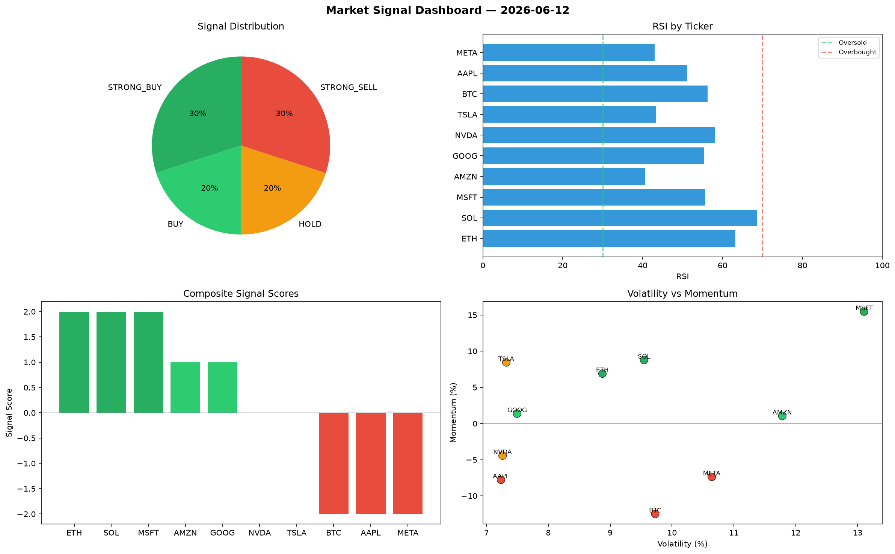

# Market Signal Report — 2026-06-12

**Run ID:** `ebd630f769` | **Buy:** 5 | **Sell:** 3 | **Hold:** 2

## Signal Dashboard

| Ticker | Price | Signal | Score | RSI | Momentum | Confidence |
|--------|-------|--------|-------|-----|----------|------------|
| ETH | $4965.16 | **STRONG_BUY** | 2 | 63.2 | 0.069 | 0.5 |
| SOL | $4367.56 | **STRONG_BUY** | 2 | 68.56 | 0.0877 | 0.5 |
| MSFT | $3902.13 | **STRONG_BUY** | 2 | 55.62 | 0.1547 | 0.5 |
| AMZN | $1922.78 | **BUY** | 1 | 40.65 | 0.0105 | 0.25 |
| GOOG | $3657.61 | **BUY** | 1 | 55.37 | 0.0137 | 0.25 |
| NVDA | $1038.85 | **HOLD** | 0 | 58.04 | -0.0444 | 0.0 |
| TSLA | $1330.48 | **HOLD** | 0 | 43.34 | 0.0844 | 0.0 |
| BTC | $484.88 | **STRONG_SELL** | -2 | 56.26 | -0.125 | 0.5 |
| AAPL | $3876.68 | **STRONG_SELL** | -2 | 51.17 | -0.0777 | 0.5 |
| META | $4056.04 | **STRONG_SELL** | -2 | 43.03 | -0.0737 | 0.5 |

## Delta vs Yesterday

| Ticker | Today | Yesterday | Price Change | Signal Changed |
|--------|-------|-----------|-------------|----------------|
| ETH | STRONG_BUY | HOLD | 📈 129.99% | ⚠️ YES |
| SOL | STRONG_BUY | STRONG_SELL | 📈 8.68% | ⚠️ YES |
| MSFT | STRONG_BUY | STRONG_BUY | 📈 122.01% | — |
| AMZN | BUY | STRONG_SELL | 📈 334.95% | ⚠️ YES |
| GOOG | BUY | HOLD | 📉 -12.78% | ⚠️ YES |
| NVDA | HOLD | HOLD | 📉 -7.48% | — |
| TSLA | HOLD | STRONG_BUY | 📉 -72.11% | ⚠️ YES |
| BTC | STRONG_SELL | STRONG_SELL | 📉 -67.25% | — |
| AAPL | STRONG_SELL | SELL | 📈 51.02% | ⚠️ YES |
| META | STRONG_SELL | BUY | 📉 -4.14% | ⚠️ YES |