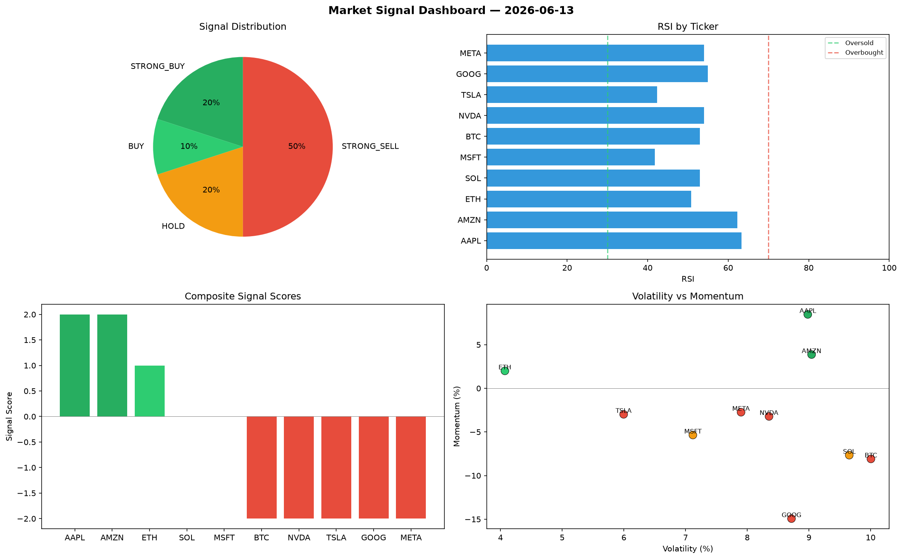

# Market Signal Report — 2026-06-13

**Run ID:** `507dca95e6` | **Buy:** 3 | **Sell:** 5 | **Hold:** 2

## Signal Dashboard

| Ticker | Price | Signal | Score | RSI | Momentum | Confidence |
|--------|-------|--------|-------|-----|----------|------------|
| AAPL | $1438.26 | **STRONG_BUY** | 2 | 63.29 | 0.0847 | 0.5 |
| AMZN | $1487.13 | **STRONG_BUY** | 2 | 62.3 | 0.0387 | 0.5 |
| ETH | $3952.69 | **BUY** | 1 | 50.78 | 0.02 | 0.25 |
| SOL | $3623.8 | **HOLD** | 0 | 52.99 | -0.0766 | 0.0 |
| MSFT | $4567.88 | **HOLD** | 0 | 41.82 | -0.0535 | 0.0 |
| BTC | $527.64 | **STRONG_SELL** | -2 | 52.94 | -0.0809 | 0.5 |
| NVDA | $4246.74 | **STRONG_SELL** | -2 | 53.96 | -0.0322 | 0.5 |
| TSLA | $40.34 | **STRONG_SELL** | -2 | 42.33 | -0.0298 | 0.5 |
| GOOG | $2479.17 | **STRONG_SELL** | -2 | 54.93 | -0.1493 | 0.5 |
| META | $805.95 | **STRONG_SELL** | -2 | 53.97 | -0.0274 | 0.5 |

## Delta vs Yesterday

| Ticker | Today | Yesterday | Price Change | Signal Changed |
|--------|-------|-----------|-------------|----------------|
| AAPL | STRONG_BUY | STRONG_BUY | 📉 -49.52% | — |
| AMZN | STRONG_BUY | SELL | 📈 191.5% | ⚠️ YES |
| ETH | BUY | BUY | 📈 36.67% | — |
| SOL | HOLD | STRONG_BUY | 📈 239.39% | ⚠️ YES |
| MSFT | HOLD | STRONG_SELL | 📈 141.2% | ⚠️ YES |
| BTC | STRONG_SELL | STRONG_BUY | 📉 -81.16% | ⚠️ YES |
| NVDA | STRONG_SELL | STRONG_BUY | 📈 23.41% | ⚠️ YES |
| TSLA | STRONG_SELL | STRONG_BUY | 📉 -98.75% | ⚠️ YES |
| GOOG | STRONG_SELL | STRONG_BUY | 📉 -11.38% | ⚠️ YES |
| META | STRONG_SELL | STRONG_SELL | 📉 -61.87% | — |